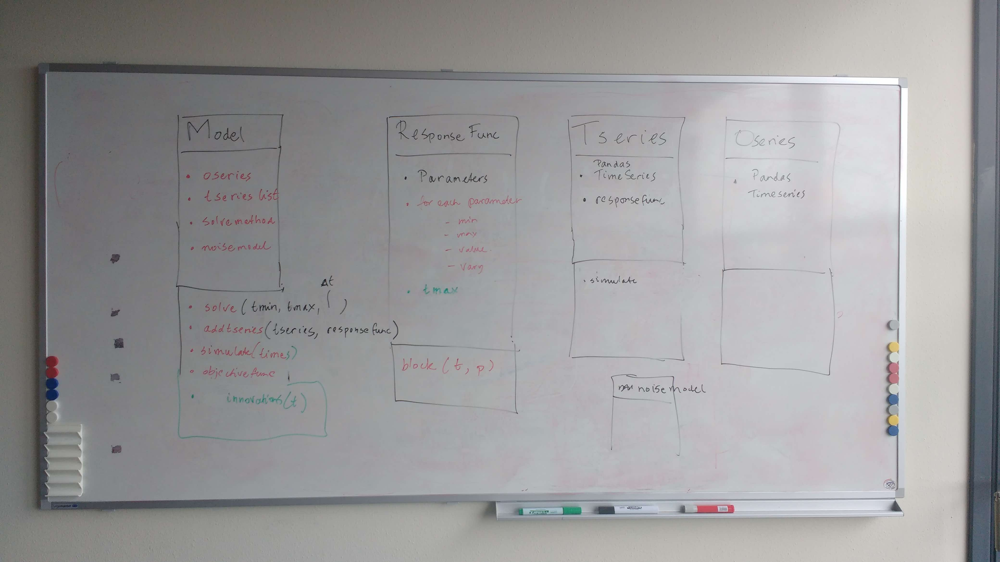

History
=======

The Development of Pastas started in the spring of 2016 at the TU Delft and
Artesia in the Netherlands. Researchers at the TU Delft required a flexible
framework that could support future research on time series analysis of
groundwater data. Consulting company `Artesia <https://www.artesia-water.nl>`_
on the other hand, needed a tool that allowed them to perform more complex
analyses in a scripted environment. As such, Pastas was developed under a
fruitful partnership between academia and private industry, a collaboration
that continues to this day.

    Drawing the initial design of Pastas on a whiteboard (5th of April, 2016)

Python was chosen as the programming language for Pastas, being a flexible and
open-source language that allows for quick prototyping. Moreover, many if not
most hydrologists learn Python during their education, making the software
available to many. From the start, all code was made completely open-source
under MIT license, embracing open science and FAIR (Findability, Accessibility,
Interoperability, and Reuse) data practices.

International use of Pastas and research grew substantially after the
publication of the Pastas article in the international journal Groundwater
:cite:p:`collenteur_pastas_2019`. In addition, the University of Graz in
Austria and now the Swiss research institute Eawag employed one of the
maintainers, further pushing the international use and development of Pastas.
Since its inception, Pastas has been applied in over a dozen countries
worldwide. Supporting international research continues to be an important goal
of Pastas. For a list of peer-reviewed publications using Pastas please see the
:doc:`Publications page <publications>`.

Pastas 1.0
----------

In february 2023, Pastas version 1.0 was released, the celebration of 7 years
of research and development of Pastas. Pastas was already operational for a
couple of years, but the a lot of features were still changing. In Pastas 1.0
focus lies on Pastas main goal: time series analysis on groundwater levels.
This was done by improving the documentation, removing unused features,
unifying the API and relying more on high quality Python packages such as
Pandas, NumPy and Numba. With version 1.0, Pastas is ready for further future
developments!

