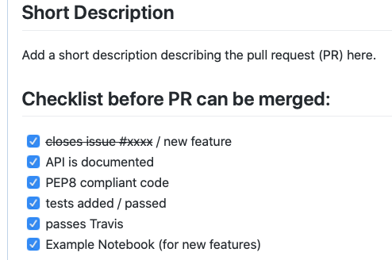
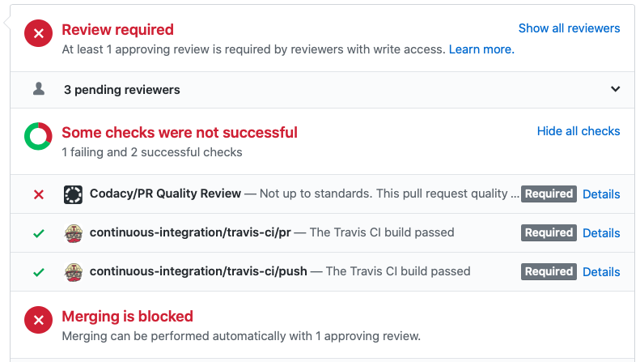

Contributing
============
We welcome you to contribute code and documentation to Pastas! This section
describes how you can contribute to Pastas and how the process works of
finally implementing your code into the stable version of the software.
GitHub, where Pastas is hosted, also has `good tutorials <https://help.github
.com/en/github/collaborating-with-issues-and-pull-requests>`_ to learn how
to commit code changes to GitHub open source projects. Let's start!

1. Create a GitHub Issue
------------------------
Before you start you can start a GitHub Issue describing the changes you
propose to make and why these are necessary. This is an easy way to inform
the Pastas communnity in an early stage of any issues that needs to be solved
and allows others to help you work out a solution.

2. Fork Pastas
--------------
To start making changes to the original code, you need to make a local copy
of the Pastas, called "Forking" in git-language. You can read how to fork a
GitHub repository `here <https://help.github
.com/en/github/getting-started-with-github/fork-a-repo>`_.

.. note::
    Make sure to make changes in the make changes in your local Development
    branch (Dev) or start an entirely new branch that branches of the
    Dev-branch.

3. Write Code
-------------
After you forked Pastas, you can start making changes to the code or add new
features to it. To ensure high quality code that is easy to read and maintain
we follow `Python PEP8 <https://www.python.org/dev/peps/pep-0008/>`_
standard. Check out the :ref:`Pastas Code Style` section to learn more.

4. Test Code
------------
The ensure a proper functioning of the Pastas, it is important to supply
tests in the test-suite (`see here <https://github
.com/pastas/pastas/tree/master/tests>`_). The ensure a proper functioning of
the Pastas, the software is automatically tested using Travis when changes
are made. Pastas uses pytest to run tests.

5. Document Code
----------------
When submitting a new function, method or class, docstrings are required
before the new code will be pulled into the dev branch. Documentation is
created using `Sphinxdoc <http://www.sphinx-doc.org>`_. Docstrings within
the method or class need to be written in `NumPy docformat <https://numpydoc
.readthedocs.io/en/latest/format.html#docstring-standard>`_ to enable
automatic documentation on this website.

A Jupyter Notebook explaining the use of your new code can be added the to
examples folder. This Notebook will also be automatically converted and
placed on the Examples page on this website.

6. Document API changes in Release Notes
----------------------------------------
Add a description of any changes in the API in the release_notes.rst file in
the doc-folder. Especially of the PR introduces backward incompatible
changes this should be clearly noted in this section.

7. Create a pull request
------------------------
Once you have written, tested, and documented your code you can start a pull
request on the development branch (dev) of Pastas. Pull requests can only
be submitted to the dev-branch and need to be reviewed by one of the core
developers. When you start your Pull Request, you will automatically see a
checklist to go through to check if your PR is up to standards. Pastas will
run automatic code tests to ensure that the code works, is documented and
has a good code style.

After you have create a Pull Request the :ref:`Core Development Team` will
review your code and discuss potential improvements on GitHub before merging
your code into the development branch. After a successful Pull Request your
code will be included in the next release!
