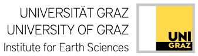
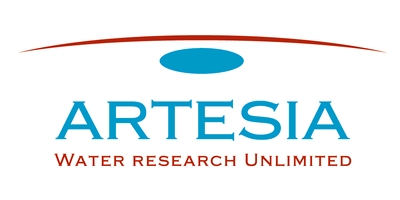

History
=======
The Development of Pastas started in the spring of 2016 at the TU Delft (The
Netherlands) and Artesia (The Netherlands). The main goal was to create a
framework that could support future research on time series analysis of
hydrogeological time series. As the project progressed the software was
developed into a stable Python package used by drinking water companies,
water boards, and engineering companies. The project is currently actively
being developed by the TU Delft, Artesia, and the University of Graz
(Austria).

