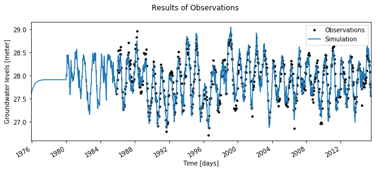
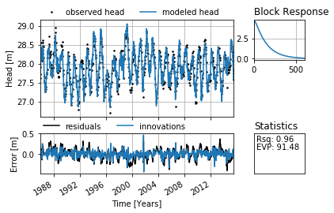

A Basic Model
=============

In this example application it is shown how a simple time series model
can be developed to simulate groundwater levels. The recharge
(calculated as preciptation minus evaporation) is used as the
explanatory time series.

.. code:: ipython3

    # First perform the necessary imports
    import pandas as pd
    import matplotlib.pyplot as plt
    import pastas as ps
    %matplotlib inline

.. parsed-literal::

    C:\Anaconda\lib\site-packages\statsmodels\compat\pandas.py:56: FutureWarning: The pandas.core.datetools module is deprecated and will be removed in a future version. Please use the pandas.tseries module instead.
      from pandas.core import datetools

1. Importing the dependent time series data
~~~~~~~~~~~~~~~~~~~~~~~~~~~~~~~~~~~~~~~~~~~

In this codeblock a time series of groundwater levels is imported using
the ``read_csv`` function of ``pandas``. As ``pastas`` expects a
``pandas`` ``Series`` object, the data is squeezed. To check if you have
the correct data type (a ``pandas Series`` object), you can use
``type(oseries)`` as shown below.

The following characteristics are important when importing and preparing
the observed time series: - The observed time series are stored as a
``pandas Series`` object. - The time step can be irregular.

.. code:: ipython3

    # Import groundwater time seriesm and squeeze to Series object
    gwdata = pd.read_csv('../data/head_nb1.csv', parse_dates=['date'], index_col='date', squeeze=True)
    print('The data type of the oseries is: %s' %type(gwdata))

    # Plot the observed groundwater levels
    gwdata.plot(style='.', figsize=(10, 4))
    plt.ylabel('Head [m]');
    plt.xlabel('Time [years]');

.. parsed-literal::

    The data type of the oseries is: <class 'pandas.core.series.Series'>

.. image:: output_3_1.png

2. Import the independent time series
~~~~~~~~~~~~~~~~~~~~~~~~~~~~~~~~~~~~~

Two explanatory series are used: the precipitation and the potential
evaporation. These need to be ``pandas Series`` objects, as for the
observed heads.

Important characteristics of these time series are: - All series are
stored as ``pandas Series`` objects. - The series may have irregular
time intervals, but then it will be converted to regular time intervals
when creating the time series model later on. - It is preferred to use
the same length units as for the observed heads.

.. code:: ipython3

    # Import observed precipitation series
    precip = pd.read_csv('../data/rain_nb1.csv', parse_dates=['date'], index_col='date', squeeze=True)
    print('The data type of the precip series is: %s' %type(precip))

    # Import observed evaporation series
    evap = pd.read_csv('../data/evap_nb1.csv', parse_dates=['date'], index_col='date', squeeze=True)
    print('The data type of the evap series is: %s' %type(evap))

    # Calculate the recharge to the groundwater
    recharge = precip - evap
    print('The data type of the recharge series is: %s' %type(recharge))

    # Plot the time series of the precipitation and evaporation
    plt.figure()
    recharge.plot(label='Recharge', figsize=(10, 4))
    plt.xlabel('Time [years]')
    plt.ylabel('Recharge (m/year)');

.. parsed-literal::

    The data type of the precip series is: <class 'pandas.core.series.Series'>
    The data type of the evap series is: <class 'pandas.core.series.Series'>
    The data type of the recharge series is: <class 'pandas.core.series.Series'>

.. image:: output_5_1.png

3. Create the time series model
~~~~~~~~~~~~~~~~~~~~~~~~~~~~~~~

In this code block the actual time series model is created. First, an
instance of the ``Model`` class is created (named ``ml`` here). Second,
the different components of the time series model are created and added
to the model. The imported time series are automatically checked for
missing values and other inconsistencies. The keyword argument fillnan
can be used to determine how missing values are handled. If any
nan-values are found this will be reported by ``pastas``.

.. code:: ipython3

    # Create a model object by passing it the observed series
    ml = ps.Model(gwdata)
    # Add the recharge data as explanatory variable
    ts1 = ps.StressModel(recharge, ps.Gamma, name='recharge', kind="evap")
    ml.add_tseries(ts1)
    # Add a noisemodel
    n = ps.NoiseModel()
    ml.add_noisemodel(n)

4. Solve the model
~~~~~~~~~~~~~~~~~~

The next step is to compute the optimal model parameters. The default
solver uses a non-linear least squares method for the optimization. The
python package ``lmfit`` is used (info on ``lmfit`` can be found
`here <https://github.com/lmfit/lmfit-py>`__). Some standard
optimization statistics are reported along with the optimized parameter
values and correlations.

.. code:: ipython3

    ml.solve()

.. parsed-literal::

    c:\python\pastas\pastas\solver.py:94: UserWarning: Caution, solving the model with a noisemodel but not weighting the innovations, please consider applying weights.
      warn("Caution, solving the model with a noisemodel but not "

.. parsed-literal::

    [[Fit Statistics]]
        # function evals   = 45
        # data points      = 644
        # variables        = 5
        chi-square         = 4.196
        reduced chi-square = 0.007
        Akaike info crit   = -3231.665
        Bayesian info crit = -3209.327
    [[Variables]]
        recharge_A:    725.320673 +/- 33.19303 (4.58%) (init= 2081.857)
        recharge_n:    1.05874456 +/- 0.013912 (1.31%) (init= 1)
        recharge_a:    129.468904 +/- 7.846712 (6.06%) (init= 100)
        constant_d:    27.5669199 +/- 0.020337 (0.07%) (init= 27.90008)
        noise_alpha:   61.7214879 +/- 8.357141 (13.54%) (init= 14)
    [[Correlations]] (unreported correlations are <  0.100)
        C(recharge_A, recharge_a)    =  0.857
        C(recharge_A, constant_d)    = -0.771
        C(recharge_a, constant_d)    = -0.665
        C(recharge_n, recharge_a)    = -0.610
        C(recharge_A, recharge_n)    = -0.256
        C(recharge_n, constant_d)    =  0.213

5. Plot the results
~~~~~~~~~~~~~~~~~~~

The solution can be plotted after a solution has been obtained.

.. code:: ipython3

    ml.plot(figsize=(10, 4))

.. image:: output_11_1.png

6. Advanced plotting
~~~~~~~~~~~~~~~~~~~~

There are many ways to further explore the time series model. ``pastas``
has some built-in functionalities that will provide the user with a
quick overview of the model. The ``plots`` subpackage contains all the
options. One of these is the method ``plots.results`` which provides a
plot with more information.

.. code:: ipython3

    ml.plots.results()

.. image:: output_13_1.png

7. Statistics
~~~~~~~~~~~~~

The ``stats`` subpackage includes a number of statistical functions that
may applied to the model. One of them is the ``summary`` method, which
gives a summary of the main statistics of the model.

.. code:: ipython3

    ml.stats.summary()

.. raw:: html

    

    
    <table border="1" class="dataframe">
      <thead>
        <tr style="text-align: right;">
          <th></th>
          <th>Value</th>
        </tr>
        <tr>
          <th>Statistic</th>
          <th></th>
        </tr>
      </thead>
      <tbody>
        <tr>
          <th>Akaike Information Criterion</th>
          <td>7.130791</td>
        </tr>
        <tr>
          <th>Average Deviation</th>
          <td>0.001135</td>
        </tr>
        <tr>
          <th>Bayesian Information Criterion</th>
          <td>29.469284</td>
        </tr>
        <tr>
          <th>Explained variance percentage</th>
          <td>91.480248</td>
        </tr>
        <tr>
          <th>Pearson R^2</th>
          <td>0.956648</td>
        </tr>
        <tr>
          <th>Root mean squared error</th>
          <td>0.125464</td>
        </tr>
      </tbody>
    </table>
    

8. Improvement: estimate evaporation factor
~~~~~~~~~~~~~~~~~~~~~~~~~~~~~~~~~~~~~~~~~~~

In the previous model, the recharge was estimated as precipitation minus
potential evaporation. A better model is to estimate the actual
evaporation as a factor (called the evaporation factor here) times the
potential evaporation. First, new model is created (called ``ml2`` here
so that the original model ``ml`` does not get overwritten). Second, the
``StressModel2`` object is created, which combines the precipitation and
evaporation series and adds a parameter for the evaporation factor
``f``. The ``StressModel2`` object is added to the model, the noise model is
added, the model is solved, and the results and statistics are plotted
to the screen. Note that the new model gives a better fit (lower root
mean squared error and higher explained variance), and that the Akiake
information criterion indicates that the addition of the additional
parameter improved the model signficantly (the Akaike criterion for
model ``ml2`` is higher than for model ``ml``).

.. code:: ipython3

    # Create a model object by passing it the observed series
    ml2 = ps.Model(gwdata)

    # Add the recharge data as explanatory variable
    ts1 = ps.StressModel2([precip, evap], ps.Gamma, name='rainevap')
    ml2.add_tseries(ts1)

    # Add a noisemodel
    n = ps.NoiseModel()
    ml2.add_noisemodel(n)

    # Solve the model
    ml2.solve()

    # Plot the results
    ml2.plot(figsize=(10, 4))

    # Statistics
    ml2.stats.summary()

.. parsed-literal::

    c:\python\pastas\pastas\solver.py:94: UserWarning: Caution, solving the model with a noisemodel but not weighting the innovations, please consider applying weights.
      warn("Caution, solving the model with a noisemodel but not "

.. parsed-literal::

    [[Fit Statistics]]
        # function evals   = 48
        # data points      = 644
        # variables        = 6
        chi-square         = 4.055
        reduced chi-square = 0.006
        Akaike info crit   = -3251.608
        Bayesian info crit = -3224.802
    [[Variables]]
        rainevap_A:    682.075315 +/- 34.31068 (5.03%) (init= 2081.857)
        rainevap_n:    1.01737535 +/- 0.015792 (1.55%) (init= 1)
        rainevap_a:    149.282350 +/- 11.23229 (7.52%) (init= 100)
        rainevap_f:   -1.26591499 +/- 0.059604 (4.71%) (init=-1)
        constant_d:    27.8770284 +/- 0.066449 (0.24%) (init= 27.90008)
        noise_alpha:   51.4134489 +/- 6.683251 (13.00%) (init= 14)
    [[Correlations]] (unreported correlations are <  0.100)
        C(rainevap_f, constant_d)    = -0.986
        C(rainevap_n, rainevap_a)    = -0.691
        C(rainevap_A, rainevap_a)    =  0.654
        C(rainevap_n, rainevap_f)    =  0.533
        C(rainevap_n, constant_d)    = -0.519
        C(rainevap_a, rainevap_f)    = -0.409
        C(rainevap_a, constant_d)    =  0.393
        C(rainevap_A, constant_d)    = -0.298
        C(rainevap_A, rainevap_f)    =  0.290

.. image:: output_17_2.png

.. raw:: html

    

    
    <table border="1" class="dataframe">
      <thead>
        <tr style="text-align: right;">
          <th></th>
          <th>Value</th>
        </tr>
        <tr>
          <th>Statistic</th>
          <th></th>
        </tr>
      </thead>
      <tbody>
        <tr>
          <th>Akaike Information Criterion</th>
          <td>9.200032</td>
        </tr>
        <tr>
          <th>Average Deviation</th>
          <td>-0.000625</td>
        </tr>
        <tr>
          <th>Bayesian Information Criterion</th>
          <td>36.006225</td>
        </tr>
        <tr>
          <th>Explained variance percentage</th>
          <td>92.928602</td>
        </tr>
        <tr>
          <th>Pearson R^2</th>
          <td>0.964396</td>
        </tr>
        <tr>
          <th>Root mean squared error</th>
          <td>0.114300</td>
        </tr>
      </tbody>
    </table>
    

Origin of the series
~~~~~~~~~~~~~~~~~~~~

-  The rainfall data is taken from rainfall station Heibloem in The
   Netherlands.
-  The evaporation data is taken from weather station Maastricht in The
   Netherlands.
-  The head data is well B58C0698, which was obtained from Dino loket
