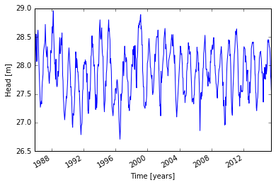
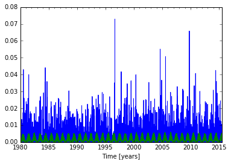
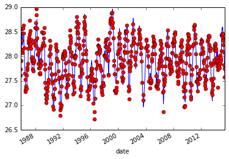
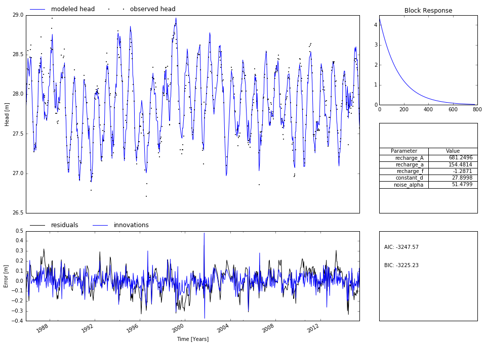

A simple time series model
==========================

In this notebook different block response functions are introduced. The
time series are convoluted with these response functions to calculate
the contribution of that stress to the head.

.. code:: python

    from gwtsa import * # Import the GWTSA package
    import numpy as np
    import pandas as pd
    import matplotlib.pyplot as plt
    # Make sure plot made in this notebook are displayed in the notebook.
    %matplotlib inline

Import observed time series
~~~~~~~~~~~~~~~~~~~~~~~~~~~

In this section the observed time series are imported. In this exaple
these are the groundwater levels observed in a well in The Netherlands
(ID B58C0698001). The following characteristics are important when
importing and preparing the observed time series: - The observed time
series are stored as a Pandas time series object - All lines must
contain a value, nan must be dropped - The time step can be irregular,
this is no problem for ``gwtsa``

.. code:: python

    # Import and check the imported groundwater level time series
    gwdata = pd.read_csv('B58C0698001_0.csv', skiprows=11,
                         parse_dates=['PEIL DATUM TIJD'],
                         index_col='PEIL DATUM TIJD',
                         skipinitialspace=True)
    gwdata.rename(columns={'STAND (MV)': 'h'}, inplace=True)
    gwdata.index.names = ['date']
    gwdata.h *= 0.01  # Make unit meters
    oseries = 30.17 - gwdata.h  # NAP
    oseries.dropna(inplace=True)
    print 'The observed series are stored as:', type(oseries) # Check the data type
    
    # Plot the observed time series
    oseries.plot();
    plt.ylabel('Head [m]');
    plt.xlabel('Time [years]');

.. parsed-literal::

    The observed series are stored as: <class 'pandas.core.series.Series'>

Import stresses
~~~~~~~~~~~~~~~

In this section the stresses are imported. Important characteristics of
these time series: - Same units as the observed time series - Values are
necessary on every time step - The time series should be stored as
Pandas Time Series

.. code:: python

    #Import and check the precipitation data
    rain = pd.read_csv('Heibloem_rain_data.dat', skiprows=4, delim_whitespace=True,
                       parse_dates=['date'],
                       index_col='date')
    rain = rain['1980':]  # cut off everything before 1980
    rain = rain.precip
    rain *=0.001
    rain.fillna(rain.mean(), inplace=True)
    
    # Import and check the evaporation data
    evap = pd.read_csv('Maastricht_E_June2015.csv', skiprows=4, sep=';',
                       parse_dates=['DATE'],
                       index_col='DATE')
    evap.rename(columns={'VALUE (m-ref)':'evap'}, inplace=True)
    evap = evap['1980':]  # cut off everything before 1980
    evap = evap.evap
    evap.fillna(evap.mean(), inplace=True)
    
    # Plot the time series of the precipitation and evaporation
    rain.plot(label='precipitation')
    evap.plot(label='evaporation')
    plt.xlabel('Time [years]')

.. parsed-literal::

    <matplotlib.text.Text at 0x10c972d90>

Model setup
~~~~~~~~~~~

In this section the model is setup. a ``tseries`` object is created for
each time series.

The time series model created below consists of the following
components: - A linear recharge model (``Tseries2``) convoluted with an
exponential decay function (``ExpDecay``). - A constant d, the base
elevation of the model - A NoiseModel (exponential error model)

.. code:: python

    ml = Model(oseries) # Create a model
    ts1 = Tseries2(rain, evap, Exponential(), name='recharge')
    ml.addtseries(ts1)
    d = Constant()
    ml.addtseries(d)
    n = NoiseModel()
    ml.addnoisemodel(n)

Solving the model
~~~~~~~~~~~~~~~~~

In this section the model is solved.

.. code:: python

    ml.solve()

.. parsed-literal::

    [[Fit Statistics]]
        # function evals   = 45
        # data points      = 644
        # variables        = 5
        chi-square         = 4.062
        reduced chi-square = 0.006
    [[Variables]]
        recharge_A:    681.249643 +/- 35.95233 (5.28%) (init= 500)
        recharge_a:    154.481366 +/- 8.160787 (5.28%) (init= 100)
        recharge_f:   -1.28707925 +/- 0.051432 (4.00%) (init=-1)
        constant_d:    27.8998426 +/- 0.057054 (0.20%) (init= 0)
        noise_alpha:   51.4798960 +/- 6.696503 (13.01%) (init= 14)
    [[Correlations]] (unreported correlations are <  0.100)
        C(recharge_f, constant_d)    = -0.981 
        C(recharge_A, recharge_a)    =  0.824 
        C(recharge_A, recharge_f)    =  0.561 
        C(recharge_A, constant_d)    = -0.543 
        C(recharge_a, recharge_f)    =  0.132 
        C(recharge_a, constant_d)    = -0.120 

Plotting the results
~~~~~~~~~~~~~~~~~~~~

.. code:: python

    ml.plot()

Plotting more information on the time series model
~~~~~~~~~~~~~~~~~~~~~~~~~~~~~~~~~~~~~~~~~~~~~~~~~~

Often a simple plot of the simulated and observed series does not give
enough informaion. To obtain more information on the calibrated model
the command ``plot_results`` provides a plot with more information.

.. code:: python

    ml.plot_results()

