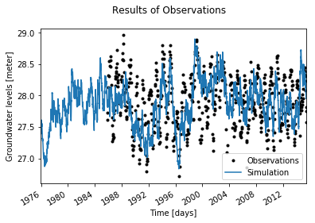

Model with two time series
==========================

.. code:: ipython3

    # First perform the necessary imports
    import pandas as pd
    import matplotlib.dates as md
    import matplotlib.pyplot as plt
    import pastas as ps
    %matplotlib inline

1. Importing the dependent time series data
~~~~~~~~~~~~~~~~~~~~~~~~~~~~~~~~~~~~~~~~~~~

.. code:: ipython3

    # Import and check the observed groundwater time series
    gwdata = pd.read_csv('../data/B58C0698001_0.csv', skiprows=11,
                         parse_dates=['PEIL DATUM TIJD'],
                         index_col='PEIL DATUM TIJD',
                         skipinitialspace=True)
    gwdata.rename(columns={'STAND (MV)': 'h'}, inplace=True)
    gwdata.index.names = ['date']
    gwdata.h *= 0.01
    oseries = 30.17 - gwdata.h  # NAP
    oseries.plot()

.. parsed-literal::

    <matplotlib.axes._subplots.AxesSubplot at 0x2ae1864f630>

.. image:: output_3_1.png

2. Import the independent time series
~~~~~~~~~~~~~~~~~~~~~~~~~~~~~~~~~~~~~

.. code:: ipython3

    # Import observed precipitation series
    precip = pd.read_csv('../data/Heibloem_rain_data.dat', skiprows=4, 
                         delim_whitespace=True, parse_dates=['date'], 
                         index_col='date')
    precip = precip.precip
    precip /= 1000.0  # Meters
    
    # Import observed evaporation series
    evap = pd.read_csv('../data/Maastricht_E_June2015.csv', 
                       skiprows=4, sep=';', parse_dates=['DATE'], 
                       index_col='DATE')
    evap.rename(columns={'VALUE (m-ref)': 'evap'}, inplace=True)
    evap = evap.evap

3. Creating the time series model
~~~~~~~~~~~~~~~~~~~~~~~~~~~~~~~~~

.. code:: ipython3

    # Initiate the base model
    ml = ps.Model(oseries)
    
    # Add the precipitation data as explanatory variable
    ts1 = ps.StressModel(precip, ps.Gamma, kind="prec", name='precip')
    ml.add_tseries(ts1)
    
    # Add the evaporation data as explanatory variable
    ts2 = ps.StressModel(evap, ps.Gamma, kind="evap", name='evap')
    ml.add_tseries(ts2)
    
    # Add a noisemodel
    n = ps.NoiseModel()
    ml.add_noisemodel(n)

4. Solving and plotting the model
~~~~~~~~~~~~~~~~~~~~~~~~~~~~~~~~~

.. code:: ipython3

    # Solve the time series model
    ml.solve(tmin="1965")

.. parsed-literal::

    2017-10-11 18:03:38,208 - pastas.model - WARNING - Specified tmin is before the first observation. tmin automatically set to 1985-11-14 00:00:00
    [[Fit Statistics]]
        # function evals   = 124
        # data points      = 644
        # variables        = 8
        chi-square         = 10.684
        reduced chi-square = 0.017
        Akaike info crit   = -2623.723
        Bayesian info crit = -2587.982
    [[Variables]]
        precip_A:      1282.61256 +/- 174.4502 (13.60%) (init= 491.3195)
        precip_n:      1.04115167 +/- 0.023737 (2.28%) (init= 1)
        precip_a:      223.624690 +/- 31.32965 (14.01%) (init= 100)
        evap_A:        5.55949345 +/- 2.50e+03 (44907.02%) (init= 634.8969)
        evap_n:        4.99603711 +/- 206.4343 (4131.96%) (init= 1)
        evap_a:        1546.61801 +/- 1.04e+05 (6715.67%) (init= 100)
        constant_d:    25.2658142 +/- 2.971590 (11.76%) (init= 27.90008)
        noise_alpha:   279.810323 +/- 71.10364 (25.41%) (init= 14)
    [[Correlations]] (unreported correlations are <  0.100)
        C(evap_A, constant_d)        = -0.990 
        C(precip_A, precip_a)        =  0.826 
        C(evap_a, constant_d)        =  0.776 
        C(evap_A, evap_a)            = -0.762 
        C(evap_A, evap_n)            = -0.450 
        C(evap_n, constant_d)        =  0.444 
        C(precip_n, precip_a)        = -0.353 
        C(precip_A, noise_alpha)     =  0.178 
        C(precip_a, constant_d)      = -0.177 
        C(evap_n, evap_a)            = -0.167 
        C(precip_A, constant_d)      = -0.164 
        C(constant_d, noise_alpha)   = -0.149 
        C(precip_A, precip_n)        =  0.143 
        C(evap_A, noise_alpha)       =  0.140 
        C(evap_a, noise_alpha)       = -0.120 
        C(precip_a, evap_a)          = -0.105 
    

.. code:: ipython3

    ml.plot();

