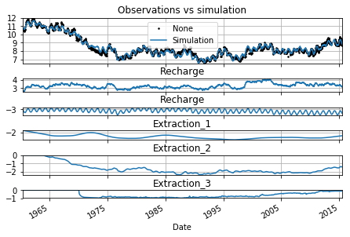

Menyanthes File
===============

R.J. Caljé, Artesia Water

Menyanthes is timeseries analysis software used by many people in the
Netherlands. In this example a Menyanthes-file with one
observation-series is imported, and simulated. There are several
stresses in the Menyanthes-file, among which are three groundwater
extractions with a significant influence on groundwater head.

.. code:: ipython3

    # First perform the necessary imports
    import matplotlib.pyplot as plt
    import pastas as ps
    %matplotlib notebook

1. Importing the Menyanthes-file
--------------------------------

Import the Menyanthes-file with observations and stresses. Then plot the
observations, together with the diferent stresses in the Menyanthes
file.

.. code:: ipython3

    # how to use it?
    fname = '../data/MenyanthesTest.men'
    meny = ps.read.MenyData(fname)
    
    # plot some series
    f1, axarr = plt.subplots(len(meny.IN)+1, sharex=True)
    oseries = meny.H['Obsevation well']["values"]
    oseries.plot(ax=axarr[0])
    axarr[0].set_title(meny.H['Obsevation well']["Name"])
    for i, val in enumerate(meny.IN.items()):
        name, data = val
        data["values"].plot(ax=axarr[i+1])
        axarr[i+1].set_title(name)
    plt.tight_layout(pad=0)
    plt.show()

.. image:: output_3_0.png

2. Run a model
--------------

Make a model with precipitation, evaporation and three groundwater
extractions.

.. code:: ipython3

    # Create the time series model
    ml = ps.Model(oseries)
    
    # Add precipitation
    IN = meny.IN['Precipitation']['values']
    IN.index = IN.index.round("D")
    IN2 = meny.IN['Evaporation']['values']
    IN2.index = IN2.index.round("D")
    ts = ps.StressModel2([IN, IN2], ps.Gamma, 'Recharge')
    ml.add_stressmodel(ts)
    
    # Add well extraction 1
    IN = meny.IN['Extraction 1']
    # extraction amount counts for the previous month
    ts = ps.StressModel(IN['values'], ps.Hantush, 'Extraction_1', up=False,
                        settings="well")
    ml.add_stressmodel(ts)
    
    # Add well extraction 2
    IN = meny.IN['Extraction 2']
    # extraction amount counts for the previous month
    ts = ps.StressModel(IN['values'], ps.Hantush, 'Extraction_2', up=False,
                        settings="well")
    ml.add_stressmodel(ts)
    
    # Add well extraction 3
    IN = meny.IN['Extraction 3']
    # extraction amount counts for the previous month
    ts = ps.StressModel(IN['values'], ps.Hantush, 'Extraction_3', up=False,
                        settings="well")
    ml.add_stressmodel(ts)
    
    # Solve the model (can take around 20 seconds..)
    ml.solve()

.. parsed-literal::

    
    Model Results Observations                Fit Statistics
    ============================    ============================
    nfev     36                     EVP                    95.85
    nobs     2846                   NS                      0.96
    noise    NoiseModel             Pearson R2              0.98
    tmin     1960-04-28 00:00:00    RMSE                    0.18
    tmax     2015-06-29 00:00:00    AIC                    23.80
    freq     D                      BIC                   113.09
    warmup   3650                   __                          
    solver   LeastSquares           ___                         
    
    Parameters (15 were optimized)
    ============================================================
                          optimal                   stderr      initial vary
    Recharge_A        1464.425545   ± 1.52653e+02 (10.42%)  1518.442830    1
    Recharge_n           1.079309    ± 3.16723e-02 (2.93%)     1.000000    1
    Recharge_a         641.269246   ± 9.95430e+01 (15.52%)    10.000000    1
    Recharge_f          -1.427450    ± 1.36050e-01 (9.53%)    -1.000000    1
    Extraction_1_A      -0.000189   ± 2.68155e-05 (14.19%)    -0.000110    1
    Extraction_1_rho     3.068035   ± 1.04033e+00 (33.91%)     1.000000    1
    Extraction_1_cS    999.136190   ± 3.67656e+02 (36.80%)   100.000000    1
    Extraction_2_A      -0.000084    ± 5.61839e-06 (6.71%)    -0.000092    1
    Extraction_2_rho     0.581416   ± 2.14472e-01 (36.89%)     1.000000    1
    Extraction_2_cS    928.406350   ± 3.97209e+02 (42.78%)   100.000000    1
    Extraction_3_A      -0.000046    ± 3.96768e-06 (8.64%)    -0.000066    1
    Extraction_3_rho     0.182493   ± 1.58133e-01 (86.65%)     1.000000    1
    Extraction_3_cS    542.744605  ± 5.93183e+02 (109.29%)   100.000000    1
    constant_d          13.131129    ± 3.89204e-01 (2.96%)     8.557530    1
    noise_alpha         32.692227    ± 2.36039e+00 (7.22%)    14.000000    1
    
    Warnings
    ============================================================
    [1] Parameter values of ['Recharge_A', 'noise_alpha'] are close to their minimum values.
    [2] Parameter values of ['Extraction_1_cS', 'Extraction_2_A', 'Extraction_3_A'] are close to their maximum values.
    
            
    

3. Plot the decomposition
-------------------------

Show the decomposition of the groundwater head, by plotting the
influence on groundwater head of each of the stresses.

.. code:: ipython3

    ax = ml.plots.decomposition(ytick_base=1.)
    ax[0].set_title('Observations vs simulation')
    ax[0].legend()
    ax[0].figure.tight_layout(pad=0)

