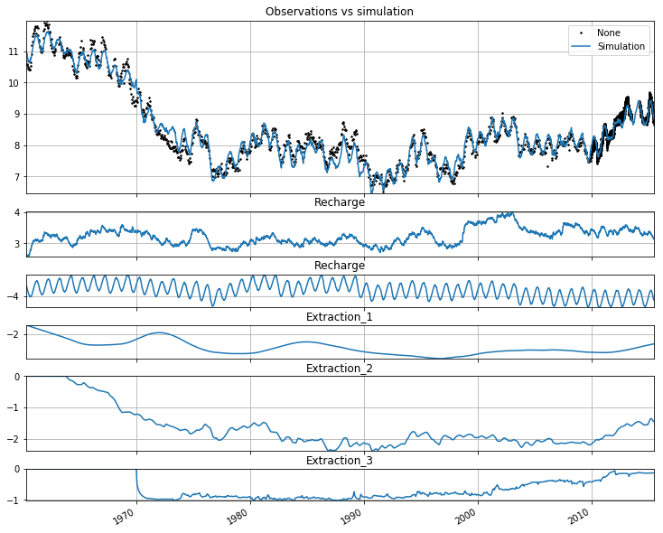

.. raw:: html

   <figure>

.. raw:: html

   </figure>

Menyanthes File
===============

*Developed by Ruben Caljé*

Menyanthes is timeseries analysis software used by many people in the
Netherlands. In this example a Menyanthes-file with one
observation-series is imported, and simulated. There are several
stresses in the Menyanthes-file, among which are three groundwater
extractions with a significant influence on groundwater head.

.. code:: ipython3

    # First perform the necessary imports
    import matplotlib.pyplot as plt
    import pastas as ps
    %matplotlib notebook

1. Importing the Menyanthes-file
--------------------------------

Import the Menyanthes-file with observations and stresses. Then plot the
observations, together with the diferent stresses in the Menyanthes
file.

.. code:: ipython3

    # how to use it?
    fname = '../data/MenyanthesTest.men'
    meny = ps.read.MenyData(fname)
    
    # plot some series
    f1, axarr = plt.subplots(len(meny.IN)+1, sharex=True)
    oseries = meny.H['Obsevation well']["values"]
    oseries.plot(ax=axarr[0])
    axarr[0].set_title(meny.H['Obsevation well']["Name"])
    for i, val in enumerate(meny.IN.items()):
        name, data = val
        data["values"].plot(ax=axarr[i+1])
        axarr[i+1].set_title(name)
    plt.tight_layout(pad=0)
    plt.show()

.. image:: output_4_0.png

2. Run a model
--------------

Make a model with precipitation, evaporation and three groundwater
extractions.

.. code:: ipython3

    # Create the time series model
    ml = ps.Model(oseries)
    
    # Add precipitation
    IN = meny.IN['Precipitation']['values']
    IN.index = IN.index.round("D")
    IN2 = meny.IN['Evaporation']['values']
    IN2.index = IN2.index.round("D")
    ts = ps.StressModel2([IN, IN2], ps.Gamma, 'Recharge')
    ml.add_stressmodel(ts)
    
    # Add well extraction 1
    IN = meny.IN['Extraction 1']
    # extraction amount counts for the previous month
    ts = ps.StressModel(IN['values'], ps.Hantush, 'Extraction_1', up=False,
                        settings="well")
    ml.add_stressmodel(ts)
    
    # Add well extraction 2
    IN = meny.IN['Extraction 2']
    # extraction amount counts for the previous month
    ts = ps.StressModel(IN['values'], ps.Hantush, 'Extraction_2', up=False,
                        settings="well")
    ml.add_stressmodel(ts)
    
    # Add well extraction 3
    IN = meny.IN['Extraction 3']
    # extraction amount counts for the previous month
    ts = ps.StressModel(IN['values'], ps.Hantush, 'Extraction_3', up=False,
                        settings="well")
    ml.add_stressmodel(ts)
    
    # Solve the model (can take around 20 seconds..)
    ml.solve()

.. parsed-literal::

    INFO: Cannot determine frequency of series None
    INFO: Inferred frequency from time series None: freq=D 
    INFO: Inferred frequency from time series None: freq=D 
    INFO: Cannot determine frequency of series None
    INFO: Time Series None were sampled down to freq D with method timestep_weighted_resample
    INFO: Cannot determine frequency of series None
    INFO: Time Series None were sampled down to freq D with method timestep_weighted_resample
    INFO: Cannot determine frequency of series None
    INFO: Time Series None were sampled down to freq D with method timestep_weighted_resample
    INFO: Time Series None were sampled down to freq D with method timestep_weighted_resample
    INFO: Time Series None were sampled down to freq D with method timestep_weighted_resample
    INFO: Time Series None were sampled down to freq D with method timestep_weighted_resample
    INFO: There are observations between the simulation timesteps. Linear interpolation between simulated values is used.
    
    Model Results Observations                Fit Statistics
    ============================    ============================
    nfev     19                     EVP                    95.37
    nobs     2842                   NSE                     0.95
    noise    1                      Pearson R2              0.95
    tmin     1960-04-29 00:00:00    RMSE                    0.19
    tmax     2015-06-29 00:00:00    AIC                    23.78
    freq     D                      BIC                   113.06
    warmup   3650                   __                          
    solver   LeastSquares           ___                         
    
    Parameters (15 were optimized)
    ============================================================
                          optimal    stderr     initial vary
    Recharge_A        1857.745129   ±24.42%  210.498526    1
    Recharge_n           0.946361    ±3.25%    1.000000    1
    Recharge_a        1545.754395   ±37.69%   10.000000    1
    Recharge_f          -1.999248   ±13.47%   -1.000000    1
    Extraction_1_A      -0.000142   ±29.81%   -0.000110    1
    Extraction_1_rho     2.595789   ±62.10%    1.000000    1
    Extraction_1_cS    999.999974   ±69.40%  100.000000    1
    Extraction_2_A      -0.000095    ±7.14%   -0.000092    1
    Extraction_2_rho     0.385018   ±37.86%    1.000000    1
    Extraction_2_cS    999.902565   ±45.22%  100.000000    1
    Extraction_3_A      -0.000044   ±11.15%   -0.000066    1
    Extraction_3_rho     0.271402  ±102.32%    1.000000    1
    Extraction_3_cS    259.942423  ±135.05%  100.000000    1
    constant_d          14.304341    ±5.18%    8.557530    1
    noise_alpha         41.724866    ±8.95%   14.000000    1
    
    Warnings
    ============================================================
    
            
    

3. Plot the decomposition
-------------------------

Show the decomposition of the groundwater head, by plotting the
influence on groundwater head of each of the stresses.

.. code:: ipython3

    ax = ml.plots.decomposition(ytick_base=1.)
    ax[0].set_title('Observations vs simulation')
    ax[0].legend()
    ax[0].figure.tight_layout(pad=0)

