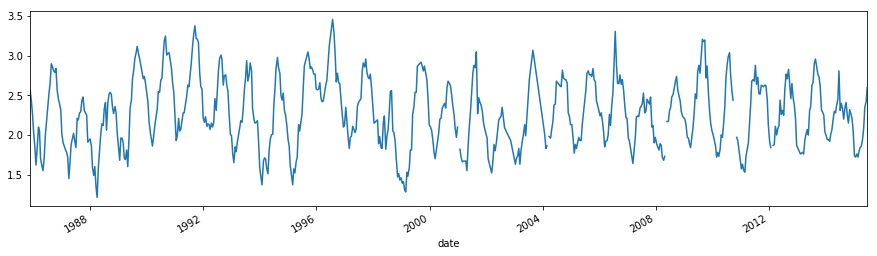
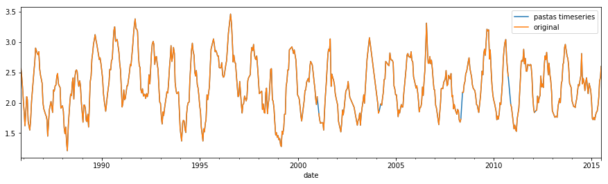
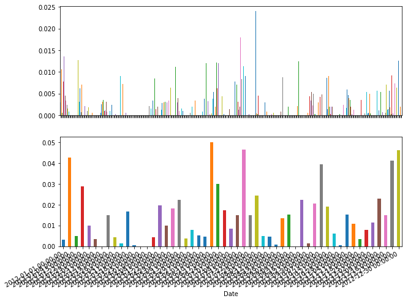
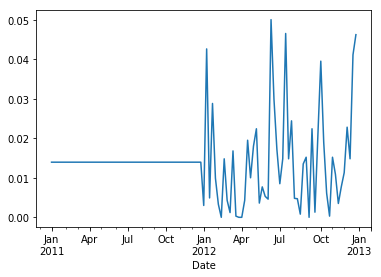

Pastas TimeSeries Objects
=========================

R.A. Collenteur, 04-11-2017, Artesia Water

In this Jupyter Notebook, the concept of the Pastas TimeSeries class is
explained in full detail. The Pastas TimeSeries class is basically an
enhanced Pandas Series object, indeed enheriting from that class as
well, with some features specific for its use in Pastas. Documentation
on the Pandas Series can be found here:
http://pandas.pydata.org/pandas-docs/stable/generated/pandas.Series.html

The central thought for the design of this class was that all
manipulations made on the user-provided dependent and independent time
series should be handled within this class. Moreover, while manipulating
the TimeSeries when working with your Pastas model, the original data
should be maintained such that only the definition of the TimeSeries and
the original series can be stored. The definition of the class can be
found on Github
(https://github.com/pastas/pastas/blob/dev/pastas/timeseries.py)

.. code:: ipython3

    import pastas as ps
    import pandas as pd
    import matplotlib.pyplot as plt
    % matplotlib inline

1. Importing groundwater time series
------------------------------------

Let's first import some time series so we have some data to play around
with. We use Pandas read\_csv method and obtain a Pandas Series object,
pandas data structure to efficiently deal with 1D Time Series data. By
default, Pandas adds a wealth of functionalities to a Series object,
such as descriptive statistics (series.describe()) and plotting
funtionality.

.. code:: ipython3

    gwdata = pd.read_csv('../data/B58C0698001_0.csv', skiprows=11,
                         parse_dates=['PEIL DATUM TIJD'],
                         index_col='PEIL DATUM TIJD',
                         skipinitialspace=True)
    gwdata.rename(columns={'STAND (MV)': 'h'}, inplace=True)
    gwdata.index.names = ['date']
    gwdata = gwdata.h * 0.01
    gwdata.plot(figsize=(15,4))

.. parsed-literal::

    <matplotlib.axes._subplots.AxesSubplot at 0x1505eb156d8>

2. Creating a Pastas TimeSeries object
--------------------------------------

The user will provide time series data when creating a model instance,
or one of the tseries elements found in tseries.py. Pastas expects
Pandas Series as a standard format in which time series are provided,
but will internally transform these to Pastas TimeSeries objects to add
the necessary funtionality. It is therefore also possible to provide a
TimeSeries object directly instead of a Pandas Series object.

We will now create a TimeSeries object for the groundwater level
(gwdata). When creating a TimeSeries object the time series that are
provided are validated, such that Pastas can use the provided time
series for simulation without errors. The time series are checked for:

1. Being actual Pandas Series object;
2. Making sure the indices are all TimeStamps;
3. Making sure the indices are ordered in time;
4. Dropping any nan-values before and after the first and final valid
   value;
5. Frequency of the Series is inferred, or otherwise the user-provided
   value for "freq" is applied;
6. Nan-values within the series are handled, depending on the value for
   the "fill\_nan" argument;
7. Duplicate indices are dropped from the series.

If all of the above is OK, a TimeSeries object is returned. When valid
time series are provided all of the above checks are no problem and no
settings are required. However, all to often this is not the case and at
least "fill\_nan" and "freq" are required. The first argument tells the
TimeSeries object how to handle nan-values, and the freq argument
provides the frequency of the original time series (default freq=D,
fill\_nan="interpolate").

.. code:: ipython3

    oseries = ps.TimeSeries(gwdata, name="Groundwater Level")
    
    # Plot the new time series and the original
    oseries.plot(figsize=(15,4), label="pastas timeseries")
    gwdata.plot(label="original")
    plt.legend()

.. parsed-literal::

    User-provided frequency is applied when validating the Time Series Groundwater Level. Make sure the provided frequency is close to the real frequency of the original series.
    

.. parsed-literal::

    <matplotlib.legend.Legend at 0x1505eaeacc0>

3. Configuring a TimeSeries object
----------------------------------

So let's see how we can configure a TimeSeries object. In the case of
the observed groundwater levels (oseries) as in the example above,
interpolating between observations might not be the preffered method to
deal with gaps in your data. In fact, the do not have to be constant for
simulation, one of the benefits of the method of impulse response
functions. The nan-values can simply be dropped. To configure a
TimeSeries object the user has three options:

1. Use a predefined configuration by using the kind="type" argument
2. providing a dictonary with the options
3. Providing the arguments as keyword arguments

For example, when creating a TimeSeries object for the groundwater
levels consider the following examples for setting the fill\_nan option:

.. code:: ipython3

    # Options 1
    oseries = ps.TimeSeries(gwdata, name="Groundwater Level", kind="oseries")
    print(oseries.settings)

.. parsed-literal::

    {'freq': 'D', 'sample_up': None, 'sample_down': None, 'fill_nan': 'drop', 'fill_before': None, 'fill_after': None, 'tmin': Timestamp('1985-11-14 00:00:00'), 'tmax': Timestamp('2015-06-28 00:00:00'), 'norm': None}
    

.. code:: ipython3

    # Option 2
    oseries = ps.TimeSeries(gwdata, name="Groundwater Level", fill_nan="drop")
    print(oseries.settings)

.. parsed-literal::

    {'freq': 'D', 'sample_up': None, 'sample_down': None, 'fill_nan': 'drop', 'fill_before': None, 'fill_after': None, 'tmin': Timestamp('1985-11-14 00:00:00'), 'tmax': Timestamp('2015-06-28 00:00:00'), 'norm': None}
    

.. code:: ipython3

    # Options 3
    oseries = ps.TimeSeries(gwdata, name="Groundwater Level", settings=dict(fill_nan="drop"))
    print(oseries.settings)

.. parsed-literal::

    {'freq': 'D', 'sample_up': None, 'sample_down': None, 'fill_nan': 'drop', 'fill_before': None, 'fill_after': None, 'tmin': Timestamp('1985-11-14 00:00:00'), 'tmax': Timestamp('2015-06-28 00:00:00'), 'norm': None}
    

Wait, what?
~~~~~~~~~~~

All of the above methods yield the same result. It is up to the user
which one is preferred. A question that may arise with options 1, is
what the possible values for ``kind`` are and what configuration is then
used. You can ask the TimeSeries class this question:

.. code:: ipython3

    pd.DataFrame(ps.TimeSeries._kind_settings).T

.. raw:: html

    

    
    <table border="1" class="dataframe">
      <thead>
        <tr style="text-align: right;">
          <th></th>
          <th>fill_after</th>
          <th>fill_before</th>
          <th>fill_nan</th>
          <th>freq</th>
          <th>sample_down</th>
          <th>sample_up</th>
        </tr>
      </thead>
      <tbody>
        <tr>
          <th>evap</th>
          <td>mean</td>
          <td>mean</td>
          <td>interpolate</td>
          <td>D</td>
          <td>sum</td>
          <td>interpolate</td>
        </tr>
        <tr>
          <th>oseries</th>
          <td>None</td>
          <td>None</td>
          <td>drop</td>
          <td>D</td>
          <td>None</td>
          <td>None</td>
        </tr>
        <tr>
          <th>prec</th>
          <td>mean</td>
          <td>mean</td>
          <td>0</td>
          <td>D</td>
          <td>sum</td>
          <td>mean</td>
        </tr>
        <tr>
          <th>waterlevel</th>
          <td>mean</td>
          <td>mean</td>
          <td>interpolate</td>
          <td>D</td>
          <td>interpolate</td>
          <td>mean</td>
        </tr>
        <tr>
          <th>well</th>
          <td>0</td>
          <td>0</td>
          <td>0</td>
          <td>D</td>
          <td>sum</td>
          <td>bfill</td>
        </tr>
      </tbody>
    </table>
    

4. Let's explore the possibilities
----------------------------------

As said, Pastas TimeSeries are capable of handling time series in a way
that is convenient for Pastas.

-  Changing the frequency of the time series (sample\_up, sameple\_down)
-  Extending the time series (fill\_before and fill\_after)
-  Normalizing the time series (norm \*not fully supported yet)

We will now import some precipitation series measured at a daily
frequency and show how the above methods work

.. code:: ipython3

    # Import observed precipitation series
    precip = pd.read_csv('../data/Heibloem_rain_data.dat', skiprows=4, 
                         delim_whitespace=True, parse_dates=['date'], 
                         index_col='date')
    precip = precip.precip["2012"]
    precip /= 1000.0  # Meters
    prec = ps.TimeSeries(precip, name="Precpipitation", kind="prec")

.. code:: ipython3

    fig, ax = plt.subplots(2, 1, figsize=(10,8))
    prec.update_series(freq="D")
    prec.plot.bar(ax=ax[0])
    prec.update_series(freq="W")
    prec.plot.bar(ax=ax[1])
    
    import matplotlib.dates as mdates
    ax[1].fmt_xdata = mdates.DateFormatter('%m')
    fig.autofmt_xdate()

Wait, what?
~~~~~~~~~~~

For those of you wondering what just happened, some more words. We just
changed the frequency of the TimeSeries without a problem. When reducing
the frequency, the values were summed into the new bins. Conveniently,
ALL pandas methods are still available and functional, such as the great
plotting functionalities of Pandas.

All this happened ``inplace``, meaning the same object just took another
shape based on the new settings. Moreover, it performed those new
settings (``freq="W"`` weekly values) on the original series. This means
that going back and forth between frequencies does not lead to any
information loss.

Why is this so important? Because when solving or simulating a model,
the Model will ask every member of the TimeSeries family to prepare
itself with the necessary settings (e.g. new freq) and perform that
operation only once. When asked for a time series, the TimeSeries object
will "be" in that new shape.

Some more action
~~~~~~~~~~~~~~~~

Let's say, we want to simulate the groundwater series for a period where
no data is available for the time series, but we need some kind of value
for the warmup period to prevent things from getting messy. The
TimeSeries object can easily extend itself, as the following example
shows.

.. code:: ipython3

    prec.update_series(tmin="2011")
    prec.plot()
    prec.settings

.. parsed-literal::

    {'fill_after': 'mean',
     'fill_before': 'mean',
     'fill_nan': 0.0,
     'freq': 'W',
     'norm': None,
     'sample_down': 'sum',
     'sample_up': 'mean',
     'tmax': Timestamp('2012-12-31 00:00:00'),
     'tmin': '2011'}

5. Exporting the TimeSeries
---------------------------

When done, we might want to store the TimeSeries object for later use. A
``dump`` method is built-in to export the original time series to a json
format, along with its current settings and name. This way the original
data is maintained and can easily be recreated from a json file.

.. code:: ipython3

    data = prec.dump()
    print(data.keys())

.. parsed-literal::

    dict_keys(['series', 'name', 'kind', 'settings', 'metadata'])
    

.. code:: ipython3

    # Tadaa, we have our extended time series in weekly frequency back!
    ts = ps.TimeSeries(**data)
    ts.plot()

.. parsed-literal::

    <matplotlib.axes._subplots.AxesSubplot at 0x150615b0c18>

.. image:: output_19_1.png

