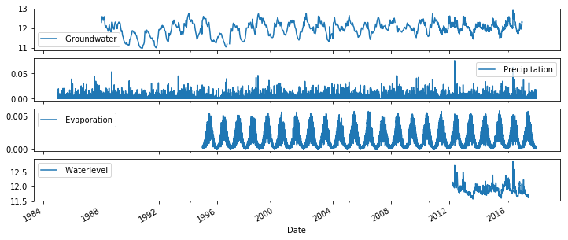
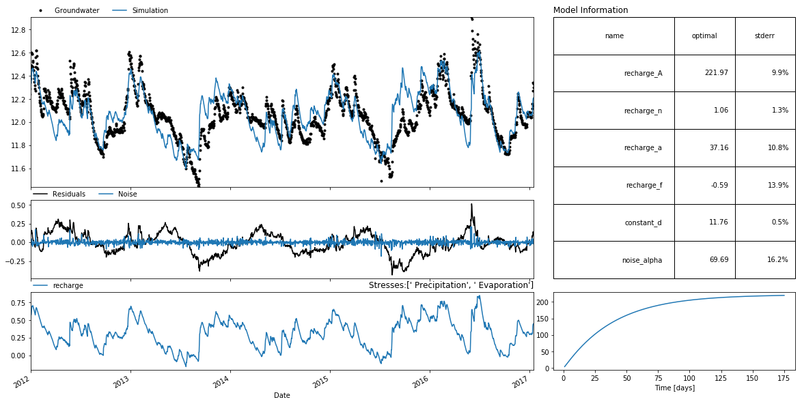
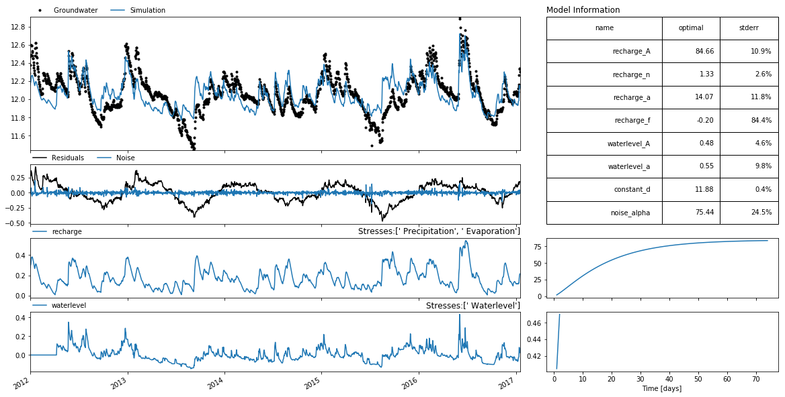

.. raw:: html

   <figure>

.. raw:: html

   </figure>

Simulating groundwater levels with a surface water level
========================================================

*Developed by Raoul Collenteur*

In this example it is shown how to create a time series model with not
only evaporation and precipitation, but also including surface water
levels. The following data is used:

-  groundwater.csv: groundwaterlevels
-  rain.csv: Precipitation
-  evap.csv: Potential evaporation
-  waterlevel.csv: Surface waterlevel

.. code:: ipython3

    import pandas as pd
    import pastas as ps
    import matplotlib.pyplot as plt
    
    %matplotlib notebook

1. import and plot the data
~~~~~~~~~~~~~~~~~~~~~~~~~~~

.. code:: ipython3

    oseries = pd.read_csv("data_notebook_5/groundwater.csv", parse_dates=True, squeeze=True, index_col=0)
    rain = pd.read_csv("data_notebook_5/rain.csv", parse_dates=True, squeeze=True, index_col=0)
    evap = pd.read_csv("data_notebook_5/evap.csv", parse_dates=True, squeeze=True, index_col=0)
    waterlevel = pd.read_csv("data_notebook_5/waterlevel.csv", parse_dates=True, squeeze=True, index_col=0)
    
    fig, axes = plt.subplots(4,1, figsize=(12, 5), sharex=True)
    oseries.plot(ax=axes[0], x_compat=True, legend=True)
    rain.plot(ax=axes[1], x_compat=True, legend=True)
    evap.plot(ax=axes[2], x_compat=True, legend=True)
    waterlevel.plot(ax=axes[3], x_compat=True, legend=True)
    

.. parsed-literal::

    <matplotlib.axes._subplots.AxesSubplot at 0x1d09dc666d8>

2. Create a timeseries model
~~~~~~~~~~~~~~~~~~~~~~~~~~~~

.. code:: ipython3

    ml = ps.Model(oseries)
    
    sm = ps.StressModel2([rain, evap], rfunc=ps.Gamma, name="recharge")
    ml.add_stressmodel(sm)
    
    ml.solve(tmin="2000")
    ml.plots.results(tmin="2012", figsize=(16, 8))
    print("The explained variance percentage over the period 2012-2017 is: %s" % ml.stats.evp(tmin="2012"))

.. parsed-literal::

    INFO: Cannot determine frequency of series  Groundwater
    INFO: 5 nan-value(s) was/were found and filled with: drop
    INFO: Inferred frequency from time series  Precipitation: freq=D 
    INFO: Inferred frequency from time series  Evaporation: freq=D 
    
    Model Results  Groundwater                Fit Statistics
    ============================    ============================
    nfev     29                     EVP                    54.70
    nobs     2412                   NSE                     0.55
    noise    1                      Pearson R2              0.55
    tmin     2000-01-01 00:00:00    RMSE                    0.15
    tmax     2017-01-16 00:00:00    AIC                    10.26
    freq     D                      BIC                    44.99
    warmup   3650                   __                          
    solver   LeastSquares           ___                         
    
    Parameters (6 were optimized)
    ============================================================
                    optimal   stderr     initial vary
    recharge_A   221.973591   ±9.86%  203.104730    1
    recharge_n     1.058145   ±1.26%    1.000000    1
    recharge_a    37.155125  ±10.83%   10.000000    1
    recharge_f    -0.587585  ±13.88%   -1.000000    1
    constant_d    11.760792   ±0.47%   12.026835    1
    noise_alpha   69.687067  ±16.17%   14.000000    1
    
    Warnings
    ============================================================
    
            
    The explained variance percentage over the period 2012-2017 is: 59.72525274482046
    

3. Adding surface water level
~~~~~~~~~~~~~~~~~~~~~~~~~~~~~

.. code:: ipython3

    w = ps.StressModel(waterlevel, rfunc=ps.Exponential,  name="waterlevel", settings="waterlevel")
    
    # Normalize the stress by the mean such that only the variation in the waterlevel matters
    w.update_stress(norm="mean")
    
    ml.add_stressmodel(w)
    ml.solve(tmin="2012")

.. parsed-literal::

    INFO: Cannot determine frequency of series  Waterlevel
    INFO: Time Series  Waterlevel were sampled down to freq D with method timestep_weighted_resample
    INFO: Time Series  Waterlevel were sampled down to freq D with method timestep_weighted_resample
    
    Model Results  Groundwater                Fit Statistics
    ============================    ============================
    nfev     30                     EVP                    52.88
    nobs     1843                   NSE                     0.53
    noise    1                      Pearson R2              0.53
    tmin     2012-01-01 00:00:00    RMSE                    0.15
    tmax     2017-01-16 00:00:00    AIC                    15.87
    freq     D                      BIC                    60.03
    warmup   3650                   __                          
    solver   LeastSquares           ___                         
    
    Parameters (8 were optimized)
    ============================================================
                    optimal   stderr     initial vary
    recharge_A    84.658784  ±10.92%  203.104730    1
    recharge_n     1.333607   ±2.60%    1.000000    1
    recharge_a    14.066842  ±11.77%   10.000000    1
    recharge_f    -0.199337  ±84.40%   -1.000000    1
    waterlevel_A   0.482584   ±4.59%    0.084191    1
    waterlevel_a   0.547852   ±9.81%   10.000000    1
    constant_d    11.883954   ±0.39%   12.026835    1
    noise_alpha   75.436413  ±24.47%   14.000000    1
    
    Warnings
    ============================================================
    
            
    

.. code:: ipython3

    ml.plots.results(figsize=(16, 8))

.. parsed-literal::

    [<matplotlib.axes._subplots.AxesSubplot at 0x1d09f958198>,
     <matplotlib.axes._subplots.AxesSubplot at 0x1d09e15e198>,
     <matplotlib.axes._subplots.AxesSubplot at 0x1d09f2c0128>,
     <matplotlib.axes._subplots.AxesSubplot at 0x1d09e10c8d0>,
     <matplotlib.axes._subplots.AxesSubplot at 0x1d09e14ae48>,
     <matplotlib.axes._subplots.AxesSubplot at 0x1d09f2b0fd0>,
     <matplotlib.axes._subplots.AxesSubplot at 0x1d09e1acb00>]

