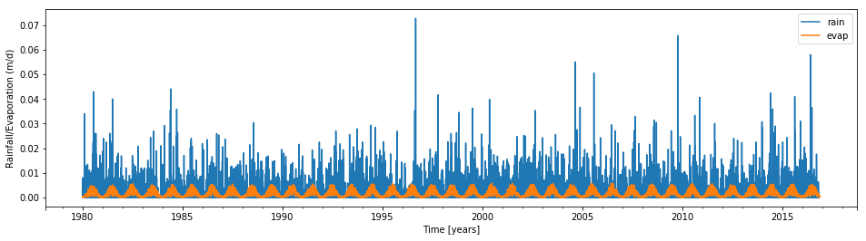
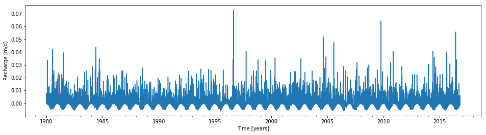
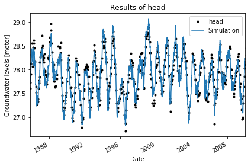

.. raw:: html

   <figure>

.. raw:: html

   </figure>

Time Series Analysis with Pastas
================================

*Developed by Mark Bakker*

Required files to run this notebook (all available from the ``data``
subdirectory): \* Head files: ``head_nb1.csv``, ``B58C0698001_1.csv``,
``B50H0026001_1.csv``, ``B22C0090001_1.csv``, ``headwell.csv`` \*
Pricipitation files: ``rain_nb1.csv``,
``neerslaggeg_HEIBLOEM-L_967.txt``, ``neerslaggeg_ESBEEK_831.txt``,
``neerslaggeg_VILSTEREN_342.txt``, ``rainwell.csv`` \* Evaporation
files: ``evap_nb1.csv``, ``etmgeg_380.txt``, ``etmgeg_260.txt``,
``evapwell.csv`` \* Well files: ``well1.csv``, ``well2.csv`` \* Figure:
``b58c0698_dino.png``

Pastas
~~~~~~

Pastas is a computer program for hydrological time series analysis and
is available from ``https://github.com/pastas/pastas`` (install the
development version!). Pastas makes heavy use of ``pandas``
``timeseries``. An introduction to ``pandas`` ``timeseries`` can be
found, for example,
`here <http://nbviewer.jupyter.org/github/mbakker7/exploratory_computing_with_python/blob/master/notebook8_pandas/py_exploratory_comp_8_sol.ipynb>`__.
The Pastas documentation is available
`here <http://pastas.readthedocs.io/en/latest/getting-started.html>`__.

.. code:: ipython3

    import pandas as pd
    import pastas as ps
    import numpy as np
    import matplotlib.pyplot as plt
    %matplotlib inline

Load the head observations
~~~~~~~~~~~~~~~~~~~~~~~~~~

The first step in time series analysis is to load a time series of head
observations. The time series needs to be stored as a ``pandas.Series``
object where the index is the date (and time, if desired). ``pandas``
provides many options to load time series data, depending on the format
of the file that contains the time series. In this example, measured
heads are stored in the csv file ``head_nb1.csv``. The heads are read
from a csv file with the ``read_csv`` function of ``pandas`` and are
then squeezed to create a ``pandas Series`` object. To check if you have
the correct data type, use the ``type`` command as shown below.

.. code:: ipython3

    ho = pd.read_csv('../data/head_nb1.csv', parse_dates=['date'], index_col='date', squeeze=True)
    print('The data type of the oseries is:', type(ho))

.. parsed-literal::

    The data type of the oseries is: <class 'pandas.core.series.Series'>
    

The variable ``ho`` is now a ``pandas Series`` object. To see the first
five lines, type ``ho.head()``.

.. code:: ipython3

    ho.head()

.. parsed-literal::

    date
    1985-11-14    27.61
    1985-11-28    27.73
    1985-12-14    27.91
    1985-12-28    28.13
    1986-01-13    28.32
    Name: head, dtype: float64

The series can be plotted as follows

.. code:: ipython3

    ho.plot(style='.', figsize=(16, 4))
    plt.ylabel('Head [m]');
    plt.xlabel('Time [years]');

.. image:: output_9_0.png

Load the stresses
~~~~~~~~~~~~~~~~~

The head variation shown above is believed to be caused by two stresses:
rainfall and evaporation. Measured rainfall is stored in the file
``rain_nb1.csv`` and measured potential evaporation is stored in the
file ``evap_nb1.csv``. The rainfall and potential evaporation are loaded
and plotted.

.. code:: ipython3

    rain = pd.read_csv('../data/rain_nb1.csv', parse_dates=['date'], index_col='date', squeeze=True)
    print('The data type of the rain series is:', type(rain))
    
    evap = pd.read_csv('../data/evap_nb1.csv', parse_dates=['date'], index_col='date', squeeze=True)
    print('The data type of the evap series is', type(evap))
    
    plt.figure(figsize=(16, 4))
    rain.plot(label='rain')
    evap.plot(label='evap')
    plt.xlabel('Time [years]')
    plt.ylabel('Rainfall/Evaporation (m/d)')
    plt.legend(loc='best');

.. parsed-literal::

    The data type of the rain series is: <class 'pandas.core.series.Series'>
    The data type of the evap series is <class 'pandas.core.series.Series'>
    

Recharge
~~~~~~~~

As a first simple model, the recharge is approximated as the measured
rainfall minus the measured potential evaporation.

.. code:: ipython3

    recharge = rain - evap
    plt.figure(figsize=(16, 4))
    recharge.plot()
    plt.xlabel('Time [years]')
    plt.ylabel('Recharge (m/d)');

First time series model
~~~~~~~~~~~~~~~~~~~~~~~

Once the time series are read from the data files, a time series model
can be constructed by going through the following three steps:

1. Creat a ``Model`` object by passing it the observed head series.
   Store your model in a variable so that you can use it later on.
2. Add the stresses that are expected to cause the observed head
   variation to the model. In this example, this is only the recharge
   series. For each stess, a ``StressModel`` object needs to be created.
   Each ``StressModel`` object needs three input arguments: the time
   series of the stress, the response function that is used to simulate
   the effect of the stress, and a name. In addition, it is recommended
   to specified the ``kind`` of series, which is used to perform a
   number of checks on the series and fix problems when needed. This
   checking and fixing of problems (for example, what to substitute for
   a missing value) depends on the kind of series. In this case, the
   time series of the stress is stored in the variable ``recharge``, the
   Gamma function is used to simulate the response, the series will be
   called ``'recharge'``, and the kind is ``prec`` which stands for
   precipitation. One of the other keyword arguments of the
   ``StressModel`` class is ``up``, which means that a positive stress
   results in an increase (up) of the head. The default value is
   ``True``, which we use in this case as a positive recharge will
   result in the heads going up. Each ``StressModel`` object needs to be
   stored in a variable, after which it can be added to the model.
3. When everything is added, the model can be solved. The default option
   is to minimize the sum of the squares of the errors between the
   observed and modeled heads.

.. code:: ipython3

    ml = ps.Model(ho)
    sm1 = ps.StressModel(recharge, ps.Gamma, name='recharge', settings='prec')
    ml.add_stressmodel(sm1)
    ml.solve(tmin='1985', tmax='2010')

.. parsed-literal::

    INFO: Cannot determine frequency of series head
    INFO: Inferred frequency from time series None: freq=D 
    
    Model Results head                Fit Statistics
    ============================    ============================
    nfev     21                     EVP                    92.11
    nobs     518                    NSE                     0.92
    noise    1                      Pearson R2              0.92
    tmin     1985-11-14 00:00:00    RMSE                    0.12
    tmax     2010-01-01 00:00:00    AIC                     7.56
    freq     D                      BIC                    28.81
    warmup   3650                   __                          
    solver   LeastSquares           ___                         
    
    Parameters (5 were optimized)
    ============================================================
                    optimal   stderr     initial vary
    recharge_A   749.626162   ±4.57%  215.674528    1
    recharge_n     1.046651   ±1.52%    1.000000    1
    recharge_a   135.213902   ±6.45%   10.000000    1
    constant_d    27.551998   ±0.07%   27.900078    1
    noise_alpha   58.375259  ±12.31%   14.000000    1
    
    Warnings
    ============================================================
    
            
    

The ``solve`` function has a number of default options that can be
specified with keyword arguments. One of these options is that by
default a fit report is printed to the screen. The fit report includes a
summary of the fitting procedure, the optimal values obtained by the
fitting routine, and some basic statistics. The model contains five
parameters: the parameters :math:`A`, :math:`n`, and :math:`a` of the
Gamma function used as the response function for the recharge, the
parameter :math:`d`, which is a constant base level, and the parameter
:math:`\alpha` of the noise model, which will be explained a little
later on in this notebook. The results of the model are plotted below.

.. code:: ipython3

    ml.plot();

.. code:: ipython3

    ml = ps.Model(ho)
    sm1 = ps.StressModel(recharge, ps.Gamma, name='recharge', settings='prec')
    ml.add_stressmodel(sm1)
    ml.solve(tmin='1985', tmax='2010', solver=ps.LeastSquares)

.. parsed-literal::

    INFO: Cannot determine frequency of series head
    INFO: Inferred frequency from time series None: freq=D 
    
    Model Results head                Fit Statistics
    ============================    ============================
    nfev     21                     EVP                    92.11
    nobs     518                    NSE                     0.92
    noise    1                      Pearson R2              0.92
    tmin     1985-11-14 00:00:00    RMSE                    0.12
    tmax     2010-01-01 00:00:00    AIC                     7.56
    freq     D                      BIC                    28.81
    warmup   3650                   __                          
    solver   LeastSquares           ___                         
    
    Parameters (5 were optimized)
    ============================================================
                    optimal   stderr     initial vary
    recharge_A   749.626162   ±4.57%  215.674528    1
    recharge_n     1.046651   ±1.52%    1.000000    1
    recharge_a   135.213902   ±6.45%   10.000000    1
    constant_d    27.551998   ±0.07%   27.900078    1
    noise_alpha   58.375259  ±12.31%   14.000000    1
    
    Warnings
    ============================================================
    
            
    

.. code:: ipython3

    ml = ps.Model(ho)
    sm1 = ps.StressModel(recharge, ps.Gamma, name='recharge', settings='prec')
    ml.add_stressmodel(sm1)
    ml.set_vary('recharge_n', 0)
    ml.solve(tmin='1985', tmax='2010', solver=ps.LeastSquares)

.. parsed-literal::

    INFO: Cannot determine frequency of series head
    INFO: Inferred frequency from time series None: freq=D 
    
    Model Results head                Fit Statistics
    ============================    ============================
    nfev     31                     EVP                    91.49
    nobs     518                    NSE                     0.91
    noise    1                      Pearson R2              0.91
    tmin     1985-11-14 00:00:00    RMSE                    0.13
    tmax     2010-01-01 00:00:00    AIC                     5.52
    freq     D                      BIC                    22.52
    warmup   3650                   __                          
    solver   LeastSquares           ___                         
    
    Parameters (4 were optimized)
    ============================================================
                    optimal   stderr     initial vary
    recharge_A   774.459823   ±5.02%  215.674528    1
    recharge_n     1.000000   ±0.00%    1.000000    0
    recharge_a   152.871577   ±5.32%   10.000000    1
    constant_d    27.540915   ±0.08%   27.900078    1
    noise_alpha   63.735380  ±12.73%   14.000000    1
    
    Warnings
    ============================================================
    
            
    

.. code:: ipython3

    ml.plot();

.. image:: output_20_0.png

