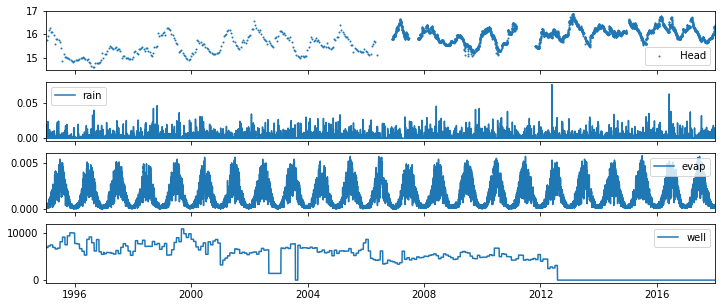
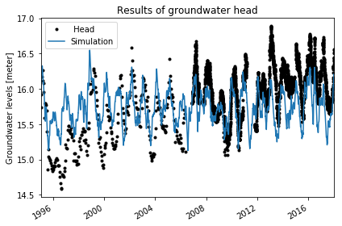
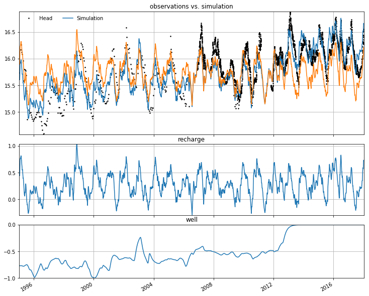
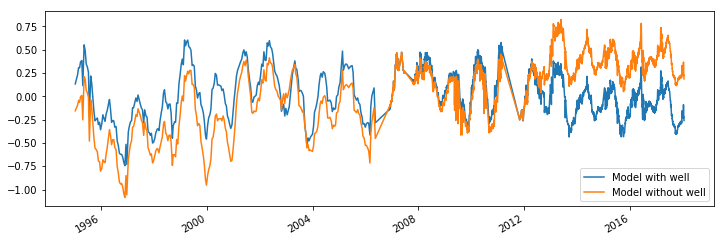

Drawdown caused by groundwater extraction
=========================================

*Developed by R.A. Collenteur & M. Bakker*

In this example notebook it is shown how to simulate the effect of a
pumping well on the groundwater levels. We will first create a TFN model
with the net recharge as the single stress used to explain the observed
heads. Second, this model is extended to include the effect of a pumping
well on the heads by adding another stress model. The simulated heads
are compared and it can be clearly seen how the addition of the pumping
well improves the simulation of the heads.

This example was also shown at the 2018 General Assembly of the European
Geophysical Union:

Bakker, M., Collenteur, R., Calje, F. Schaars (2018, April) Untangling
groundwater head series using time series analysis and Pastas. In EGU
General Assembly 2018.
https://meetingorganizer.copernicus.org/EGU2018/EGU2018-7194.pdf

.. code:: ipython3

    import pandas as pd
    import pastas as ps
    import numpy as np
    import matplotlib.pyplot as plt
    %matplotlib inline

2. Read the time series from files
~~~~~~~~~~~~~~~~~~~~~~~~~~~~~~~~~~

All time series for this example have been prepared as csv-files, which
are read using the Pandas ``read_csv``- method. The following time
series are available:

-  heads in meters above the Dutch National Datum (NAP), irregular time
   steps
-  rain in m/d
-  Makkink reference evaporation in m/d
-  Pumping extraction rate in m\ :math:`^3`/d. The pumping well stopped
   operating after 2012.

.. code:: ipython3

    head = pd.read_csv("data_notebook_7/head_wellex.csv", index_col="Date", parse_dates=True, squeeze=True)
    rain =  pd.read_csv("data_notebook_7/prec_wellex.csv", index_col="Date", parse_dates=True)
    evap =  pd.read_csv("data_notebook_7/evap_wellex.csv", index_col="Date", parse_dates=True)
    well =  pd.read_csv("data_notebook_7/well_wellex.csv", index_col="Date", parse_dates=True)
    
    # Make a plot of all the time series
    fig, ax = plt.subplots(4, 1, sharex=True, figsize=(12,5));
    ax[0].plot(head, label=head.name, linestyle=" ", marker=".", markersize=2)
    ax[0].legend()
    ax[1].plot(rain, label="rain")
    ax[1].legend()
    ax[2].plot(evap, label="evap")
    ax[2].legend()
    ax[3].plot(well, label="well")
    ax[3].legend()
    plt.xlim("1995", "2018");

3. Create a Pastas Model
~~~~~~~~~~~~~~~~~~~~~~~~

A pastas Model is created. A constant and a noisemodel are automatically
added. The effect of the net groundwater recharge :math:`R(t)` is
simulated using the ``ps.RechargeModel`` stress model. Net recharge is
calculated as :math:`R(t) = P(t) - f * E(t)` where :math:`f` is a
parameter that is estimated and :math:`P(t)` and :math:`E(t)` are
precipitation and reference evapotranspiration, respectively.

.. code:: ipython3

    # Create the time series model
    ml = ps.Model(head, name="groundwater head", log_level="ERROR")
    
    # Add the stres model for the net recharge
    rm = ps.RechargeModel(rain, evap, name="recharge", rfunc=ps.Gamma)
    ml.add_stressmodel(rm)
    ml.solve()
    ml.plot();
    
    # Let's store the simulated values to compare later
    sim1 = ml.simulate()
    res1 = ml.residuals()
    n1 = ml.noise()

.. parsed-literal::

    Model Results groundwater he       Fit Statistics
    =================================================
    nfev     25                     EVP         38.78
    nobs     3869                   R2           0.02
    noise    1                      RMSE         0.35
    tmin     1995-01-14 00:00:00    AIC          9.51
    tmax     2018-01-12 00:00:00    BIC         47.07
    freq     D                      ___              
    warmup   3650                   ___              
    solver   LeastSquares           ___              
    
    Parameters (6 were optimized)
    =================================================
                    optimal   stderr     initial vary
    recharge_A   283.870680   ±9.78%  203.104730    1
    recharge_n     1.435684   ±1.74%    1.000000    1
    recharge_a    34.463345   ±8.71%   10.000000    1
    recharge_f    -0.622213  ±13.82%   -1.000000    1
    constant_d    15.395040   ±0.80%   15.975755    1
    noise_alpha  354.413365  ±30.65%   14.000000    1
    

Interpreting the results
~~~~~~~~~~~~~~~~~~~~~~~~

As can be seen from the above plot, the observed heads show a clear rise
whereas the simulated heads do not show this behaviour. The rise in the
heads cannot be explained by an increased precipitation or a decreased
evaporation over time, and it is likely another force is driving the
heads upwards. Given the location of the well, we can hypothesize that
the groundwater pumping caused a lowering of the heads in the beginning
of the observations, which decreased when the pumping well was shut
down. A next logical step is to add the effect of the pumping well and
see if it improves the simulation of the head.

Add the effect of the pumping well
~~~~~~~~~~~~~~~~~~~~~~~~~~~~~~~~~~

To simulate the effect of the pumping well a new stress model is added.
The effect of the well is simulated using the ``ps.StressModel``, which
convoluted a stress with a response function. As a response function the
``ps.Hantush`` response function is used. The keyword-argument
``up=False`` is provided to tell the model this stress is supposed to
have a lowering effect on the groundwater levels.

.. code:: ipython3

    # Add the stress model for the pumping well
    sm = ps.StressModel(well, rfunc=ps.Hantush, name="well", settings="well", up=False)
    ml.add_stressmodel(sm)
    
    # Solve the model and make a plot
    ml.solve()
    [ax1, ax2, ax3] = ml.plots.decomposition()
    ax1.plot(sim1) # Add the previously simulated values to the plot

.. parsed-literal::

    Model Results groundwater he       Fit Statistics
    =================================================
    nfev     33                     EVP         58.75
    nobs     3869                   R2           0.58
    noise    1                      RMSE         0.23
    tmin     1995-01-14 00:00:00    AIC         15.52
    tmax     2018-01-12 00:00:00    BIC         71.87
    freq     D                      ___              
    warmup   3650                   ___              
    solver   LeastSquares           ___              
    
    Parameters (9 were optimized)
    =================================================
                    optimal   stderr     initial vary
    recharge_A   233.453552   ±9.22%  203.104730    1
    recharge_n     1.463305   ±1.82%    1.000000    1
    recharge_a    28.111771   ±8.42%   10.000000    1
    recharge_f    -0.623713  ±15.33%   -1.000000    1
    well_A        -0.000108  ±18.52%   -0.000338    1
    well_rho       1.584582  ±53.28%    1.000000    1
    well_cS       98.775343  ±70.99%  100.000000    1
    constant_d    15.929975   ±0.73%   15.975755    1
    noise_alpha  189.886842  ±26.49%   14.000000    1
    

.. parsed-literal::

    [<matplotlib.lines.Line2D at 0x1c1d240780>]

Interpreting the results
~~~~~~~~~~~~~~~~~~~~~~~~

The addition of the pumping well to simulate the heads clearly improved
the fit with the observed heads. It can also be seen how the pumping
well stops contributing to the lowering of the head after ~2014,
indicating the pumping effect of the well has dampened out. The period
it takes before the historic pumping has no effect anymore can be
approximated by the length of the response function for the well (e.g.,
``len(ml.get_step_response("well"))``).

Analyzing the residuals
~~~~~~~~~~~~~~~~~~~~~~~

The difference between the model with and without the pumping becomes
even more clear when analyzing the model residuals. The residuals of the
model without the well show a clear upward trend, whereas the model with
a model does not show this trend anymore.

.. code:: ipython3

    ml.residuals().plot(figsize=(12, 4))
    res1.plot()
    plt.legend(["Model with well", "Model without well"])

.. parsed-literal::

    <matplotlib.legend.Legend at 0x1c1d734ba8>

