Cross-correlation and Autocorrelation in Pastas
===============================================

Background
~~~~~~~~~~

The ``pastas.stats.ccf`` function doesn't give the expected results.
This is caused by the fact that in the calculation method, both the
positive lag and negative lag are considered together. In
autocorrelation this isn't a problem as the autocorrelation for all lags
is symmetrical. For cross-correlation this is not necessarily the case.
A change in the ``ccf`` function is proposed that only considers the
positive lags.

The original ``pastas.stats.ccf`` method also scales the calculated
result by the absolute maximum of the calculated CCF. This means that
regardless of how completely unsimilar two series are there is always a
lag at which the correlation is given to be 1.0. This also seems
dubious, therefore in the new implementation this step has been removed.

For series with constant timesteps the calculated correlations are
compared to the results obtained through ``numpy.correlate``. The
calculated correlation is scaled so that the result is between -1.0 and
1.0. This same scaling is also applied in the pastas functions.

Note: the use of the number of overlapping elements to scale the result
can lead to calculated correlations larger than 1.0, or to perfectly
matching series having a correlation that is smaller than 1.0. This is
caused by the fact that the two series are normalized at start of the
calculation. When shifting one series relative to another, only the
overlapping part of the series is considered and scaled by the number of
overlapping elements. This overlapping part of the series might not
satisfy the conditions of a normalized series (:math:`\mu = 0` and
:math:`\sigma = 1.0`). This means the maximum correlation of the
overlapping parts can be either larger or smaller than the number of
overlapping elements. When scaling by the number of overlapping elements
this can yield correlations unequal to 1.0 for series that match one
another perfectly. Thie effect is presumably smaller when the maximum
lag << observation period and the total number of measurements is large.

Table of contents
~~~~~~~~~~~~~~~~~

1. `Adjusted ``pastas.stats.ccf`` function <#1>`__
2. `Test data <#2>`__
3. `Helper functions <#3>`__
4. `Test new ACF (constant timesteps) <#4>`__
5. `Test new CCF (constant timesteps) <#5>`__
6. `Test new ACF (different timesteps) <#6>`__
7. `Test new CCF (different timesteps) <#7>`__

.. code:: ipython3

    import numpy as np
    import pandas as pd
    from pandas import Timedelta, Series, DataFrame
    import pastas as ps
    import matplotlib.pyplot as plt

1. `Adjusted ``pastas.stats.ccf`` function <#top>`__\ 
------------------------------------------------------

.. code:: ipython3

    def acf(x, lags=None, bin_method='gaussian', bin_width=None, max_gap=np.inf,
            min_obs=10, output="acf"):
        """Method to calculate the autocorrelation function for irregular
        timesteps based on the slotting technique. Different methods (kernels)
        to bin the data are available.
    
        Parameters
        ----------
        x: pandas.Series
            Pandas Series containig the values to calculate the
            cross-correlation for. The index has to be a Pandas.DatetimeIndex
        lags: numpy.array, optional
            numpy array containing the lags in days for which the
            cross-correlation if calculated. [0, 1, 2, 3, 4, 5, 6, 7, 8, 9, 10,
            12, 13, 14, 30, 61, 90, 120, 150, 180, 210, 240, 270, 300, 330, 365]
        bin_method: str, optional
            method to determine the type of bin. Options are "gaussian" (default),
            sinc and rectangle.
        bin_width: float, optional
            number of days used as the width for the bin to calculate the
            correlation. By default these values are chosed based on the
            bin_method.
        max_gap: float, optional
            Maximum timestep gap in the data. All timesteps above this gap value
            are not used for calculating the average timestep. This can be
            helpfull when there is a large gap in the data that influences the
            average timestep.
    
        Returns
        -------
        CCF: pandas.Series
            The Cross-correlation function.
    
        References
        ----------
        Rehfeld, K., Marwan, N., Heitzig, J., Kurths, J. (2011). Comparison
        of correlation analysis techniques for irregularly sampled time series.
        Nonlinear Processes in Geophysics. 18. 389-404. 10.5194 pg-18-389-2011.
    
        Examples
        --------
        acf = ps.stats.ccf(x, y, bin_method="gaussian")
    
        """
        C = ccf(x=x, y=x, lags=lags, bin_method=bin_method, bin_width=bin_width,
                max_gap=max_gap, min_obs=min_obs, output=output)
        C.name = "ACF"
        return C
    
    
    def ccf(x, y, lags=None, bin_method='gaussian', bin_width=None,
            max_gap=np.inf, min_obs=10, output="ccf"):
        """Method to calculate the cross-correlation function for irregular
        timesteps based on the slotting technique. Different methods (kernels)
        to bin the data are available.
    
        Parameters
        ----------
        x, y: pandas.Series
            Pandas Series containig the values to calculate the
            cross-correlation for. The index has to be a Pandas.DatetimeIndex
        lags: numpy.array, optional
            numpy array containing the lags in days for which the
            cross-correlation if calculated. [0, 1, 2, 3, 4, 5, 6, 7, 8, 9, 10,
            12, 13, 14, 30, 61, 90, 120, 150, 180, 210, 240, 270, 300, 330, 365]
        bin_method: str, optional
            method to determine the type of bin. Options are "gaussian" (default),
            sinc and rectangle.
        bin_width: float, optional
            number of days used as the width for the bin to calculate the
            correlation. By default these values are chosed based on the
            bin_method.
        max_gap: float, optional
            Maximum timestep gap in the data. All timesteps above this gap value
            are not used for calculating the average timestep. This can be
            helpfull when there is a large gap in the data that influences the
            average timestep.
    
        Returns
        -------
        CCF: pandas.Series
            The Cross-correlation function.
    
        References
        ----------
        Rehfeld, K., Marwan, N., Heitzig, J., Kurths, J. (2011). Comparison
        of correlation analysis techniques for irregularly sampled time series.
        Nonlinear Processes in Geophysics. 18. 389-404. 10.5194 pg-18-389-2011.
    
        Examples
        --------
        acf = ps.stats.ccf(x, y, bin_method="gaussian")
    
        """
        # prepare the time indices for x and y
        dt_x = x.index.to_series().diff().values / Timedelta(1, "D")
        dt_x[0] = 0.0
        dt_x_mu = dt_x[dt_x < max_gap].mean()  # Deal with big gaps if present
        t_x = np.cumsum(dt_x)
    
        dt_y = y.index.to_series().diff().values / Timedelta(1, "D")
        dt_y[0] = 0.0
        dt_y_mu = dt_y[dt_y < max_gap].mean()
        t_y = np.cumsum(dt_y)
    
        dt_mu = max(dt_x_mu, dt_y_mu)
    
        # Create matrix with time differences
        t1, t2 = np.meshgrid(t_x, t_y)
        
        # Do not take absolute value and set values to nan where t < 0.
        # This means only positive lags can be calculated!
        t = np.subtract(t1, t2)
        t[t<0] = np.nan
    
        # Normalize the values and create numpy arrays
        x = (x.values - x.values.mean()) / x.values.std()
        y = (y.values - y.values.mean()) / y.values.std()
    
        # Create matrix for covariances
        xy = np.outer(y, x)
    
        if lags is None:  # Default lags in Days, log-scale between 0 and 365.
            lags = [0, 1, 2, 3, 4, 5, 6, 7, 8, 9, 10, 12, 13, 14, 30, 61, 90, 120,
                    150, 180, 210, 240, 270, 300, 330, 365]
    
        # Remove lags that cannot be determined because lag < dt_min
        u, i = np.unique(dt_x, return_counts=True)
        dt_x_min = u[Series(i, u).cumsum() >= min_obs][0]
        u, i = np.unique(dt_y, return_counts=True)
        dt_y_min = u[Series(i, u).cumsum() >= min_obs][0]
    
        dt_min = min(dt_x_min, dt_y_min)
        # dt_min = min(dt_x[1:].min(), dt_y[1:].min())
    
        lags = np.array([float(lag) for lag in lags if lag >= dt_min or lag == 0])
    
        # Delete to free memory
        del (x, y, dt_x, dt_y, t1, t2, t_x, t_y)
    
        # Select appropriate bin_width, default depend on bin_method
        if bin_width is None:
            options = {"rectangle": 0.5, "sinc": 1, "gaussian": 0.25}
            bin_width = np.ones_like(lags) * options[bin_method] * dt_mu
        elif type(bin_width) is float:
            bin_width = np.ones_like(lags)
        else:
            bin_width = [0.5, 1, 2, 2, 2, 2, 2, 2, 2, 2, 2, 2, 2, 2, 5, 5, 5, 5,
                         2, 2, 2, 2, 2, 2, 2, 2]
    
        # Select the binning method to calculate the cross-correlation
        if bin_method == "rectangle":
            a = np.zeros_like(t, dtype=float)
            kernel_func = lambda d, h: np.less_equal(np.abs(d, out=a), h,
                                                     out=a).astype(int)
        elif bin_method == "gaussian":
            a = np.zeros_like(t, dtype=float)
    
            def kernel_func(d, h):
                den1 = -2 * h ** 2  # denominator 1
                den2 = np.sqrt(2 * np.pi * h)  # denominator 2
                return np.exp(np.square(d, out=a) / den1, out=a) / den2
        elif bin_method == "sinc":
            kernel_func = lambda d, h: np.sin(np.pi * h * d) / (np.pi * h * d)
        else:
            raise NotImplementedError("bin_method %s is not implemented." %
                                      bin_method)
    
        # Pre-allocate an array to speed up all numpy methods
        UDCF = np.zeros_like(lags, dtype=float)
        M = np.zeros_like(lags, dtype=float)
        d = np.zeros_like(t, dtype=float)
    
        for i, k in enumerate(lags):
            # Construct the kernel for the lag
            np.subtract(t, k, out=d)
            h = bin_width[i]
            b = kernel_func(d, h)
            c = np.multiply(xy, b, out=d)  # Element-wise multiplication
            
            # Use nansum to avoid the NaNs that are now in these matrices
            UDCF[i] = np.nansum(c)
            M[i] = np.nansum(b)
    
        DCF = UDCF / M  # scale (by length of the overlap when bin_method="rectangle")
        C = Series(data=DCF, index=lags, name="CCF")
        CCF = C
        
        if output == "full":
            CCFstd = np.sqrt((np.cumsum(UDCF) - M * DCF) ** 2) / (M - 1)
            CCF = DataFrame(data={"CCF": CCF.values, "stderr": CCFstd}, index=lags)
    
        CCF.index.name = "Lags (Days)"
        return CCF

2. `Test data <#top>`__\ 
-------------------------

2 sines (equal timesteps)
~~~~~~~~~~~~~~~~~~~~~~~~~

.. code:: ipython3

    t = np.arange(0, 100)
    T = 20.0/(2*np.pi)
    lag = 3.0
    custom_index = pd.date_range(pd.datetime.today(), periods=len(t))
    
    s1 = pd.Series(index=custom_index, data=np.sin(t/T))
    s2 = pd.Series(index=custom_index, data=2*np.sin(1*t/T - lag/T))
    
    fig, ax = plt.subplots(1, 1, figsize=(16, 5))
    s1.plot(ax=ax, marker=".")
    s2.plot(ax=ax, marker=".")

.. parsed-literal::

    <matplotlib.axes._subplots.AxesSubplot at 0x20668a7f8d0>

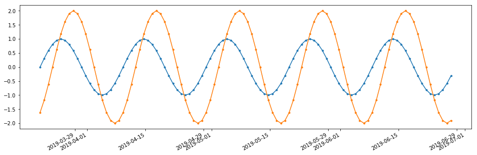

2 sines unequal timesteps
~~~~~~~~~~~~~~~~~~~~~~~~~

.. code:: ipython3

    t1 = np.arange(0, 100)
    t2 = np.r_[np.linspace(0, 50, 75), np.linspace(50, 99, 25)]
    
    T = 20.0/(2*np.pi)
    custom_index1 = pd.date_range(pd.datetime.today(), periods=len(t))
    custom_index2 = []
    for i, ti in enumerate(t2):
        custom_index2.append(custom_index1[0] + pd.DateOffset(days=ti))
    
    custom_index2 = np.array(custom_index2)
    
    s3 = pd.Series(index=custom_index1, data=np.sin(t1/T))
    s4 = pd.Series(index=custom_index2, data=2*np.sin(1*t2/T - 3/T))
    
    fig, ax = plt.subplots(1, 1, figsize=(16, 5))
    s3.plot(ax=ax, marker=".")
    s4.plot(ax=ax, marker=".")

.. parsed-literal::

    <matplotlib.axes._subplots.AxesSubplot at 0x2066c2772e8>

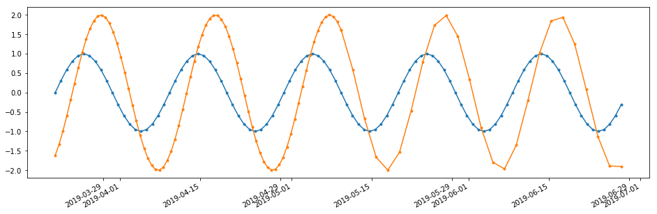

2 peaks (equal timesteps)
~~~~~~~~~~~~~~~~~~~~~~~~~

.. code:: ipython3

    t = np.arange(0, 100)
    custom_index = pd.date_range(pd.datetime.today(), periods=len(t))
    
    lag1 = 11
    lag2 = 2
    alpha = 5.0
    
    s5 = pd.Series(index=custom_index, data=np.zeros(len(t)))
    to_timestep = len(s5.loc[custom_index1[0] + pd.Timedelta(days=lag1):])
    s5.loc[custom_index[0] + pd.Timedelta(days=lag1):] = np.exp(-np.arange(len(t))/alpha)[:to_timestep]
    s6 = pd.Series(index=custom_index, data=np.zeros(len(t)))
    to_timestep = len(s6.loc[custom_index1[0] + pd.Timedelta(days=lag2):])
    s6.loc[custom_index[0] + pd.Timedelta(days=lag2):] = 2*np.exp(-np.arange(len(t))/alpha)[:to_timestep]
    
    fig, ax = plt.subplots(1, 1, figsize=(16, 5))
    s5.plot(ax=ax, marker=".")
    s6.plot(ax=ax, marker=".")

.. parsed-literal::

    <matplotlib.axes._subplots.AxesSubplot at 0x2066c3e1358>

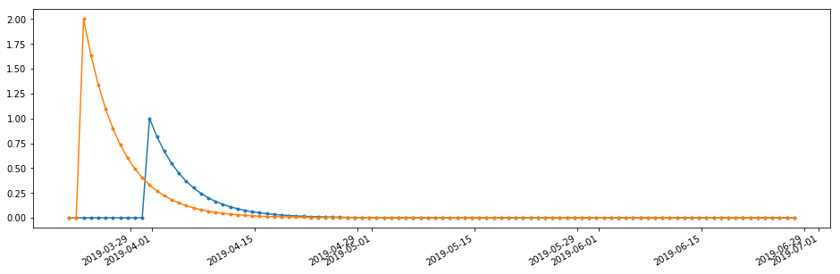

2 peaks (unequal timesteps)
~~~~~~~~~~~~~~~~~~~~~~~~~~~

.. code:: ipython3

    t1 = np.arange(0, 100)
    t2 = np.r_[np.linspace(0, 50, 75), np.linspace(50, 99, 25)]
    custom_index1 = pd.date_range(pd.datetime.today(), periods=len(t1))
    custom_index2 = []
    
    for ti in t2:
        custom_index2.append(custom_index1[0] + pd.DateOffset(days=ti))
    custom_index2 = np.array(custom_index2)
    
    lag1 = 11
    lag2 = 2
    alpha = 5.0
    
    s7 = pd.Series(index=custom_index1, data=np.zeros(len(t1)))
    to_timestep = len(s7.loc[custom_index1[0] + pd.Timedelta(days=lag1):])
    s7.loc[custom_index1[0] + pd.Timedelta(days=lag1):] = np.exp(-np.arange(len(t1))/alpha)[:to_timestep]
    
    s8 = pd.Series(index=custom_index2, data=np.zeros(len(t2)))
    to_timestep = len(s8.loc[custom_index2[0] + pd.Timedelta(days=lag2):])
    s8.loc[custom_index2[0] + pd.Timedelta(days=lag2):] = np.exp(-np.arange(len(t2))/alpha)[:to_timestep]
    
    fig, ax = plt.subplots(1, 1, figsize=(16, 5))
    s7.plot(ax=ax, marker=".")
    s8.plot(ax=ax, marker=".")

.. parsed-literal::

    <matplotlib.axes._subplots.AxesSubplot at 0x2066d6e1e80>

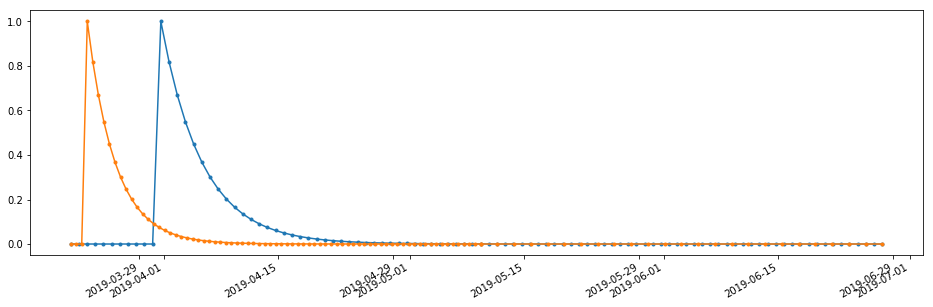

3. `Create some helper functions to compare datasets <#top>`__\ 
----------------------------------------------------------------

.. code:: ipython3

    def compare_acf_funcs(s1, lags=None, bin_method="rectangle", numpycorr=True, scale_w_max=False):
        s1n = (s1.values - s1.mean()) / s1.std()
        
        if numpycorr:
            overlap = np.r_[np.arange(1, len(s1)+1), np.arange(len(s1)-1, 0, -1)]
    
            ACF_np = np.correlate(s1n, s1n, mode="full") / overlap
            ACF_np = ACF_np[len(ACF_np)//2:]
            ACF_np = pd.Series(index=lags, data=ACF_np, name="ACF numpy")
        
        ACF_pastas = ps.stats.acf(s1, bin_method=bin_method, lags=lags)
        ACF_pastas.name = "ACF_orig"
        ACF_new = acf(s1, bin_method=bin_method, lags=lags)
        ACF_new.name = "ACF_new"
        if scale_w_max:
            ACF_new /= ACF_new.abs().max()
            
        fig, ax = plt.subplots(1, 1, figsize=(16, 6))
        ax.plot(ACF_pastas.index, ACF_pastas, marker="o", label="Old Pastas ACF implementation")
        ax.plot(ACF_new.index, ACF_new, marker="x", label="Proposed Pastas ACF implementation")
        if numpycorr:
            ax.plot(lags, ACF_np, ls="dotted", marker="+", color="C3", label="Numpy ACF implementation")
        ax.legend(loc="best")
        ax.grid(b=True)
        ax.set_xlabel("Lags (days)")
        ax.set_ylabel("Autocorrelation (-)");
        if numpycorr:
            return pd.concat([ACF_pastas, ACF_new, ACF_np], axis=1)
        else:
            return pd.concat([ACF_pastas, ACF_new], axis=1)
    
    def compare_ccf_funcs(s1, s2, lags=None, bin_method="rectangle", numpycorr=True, scale_w_max=False):
        s1n = (s1.values - s1.mean()) / s1.std()
        s2n = (s2.values - s2.mean()) / s2.std()
        if numpycorr:
            maxlen = np.amax([len(s1), len(s2)])
            overlap = np.r_[np.arange(1, len(s2)+1), len(s2)*np.ones(len(s1)-len(s2)), np.arange(len(s2)-1, 0, -1)]
            CCF_np = np.correlate(s1n, s2n, mode="full") / overlap
            CCF_np = CCF_np[len(CCF_np)//2:]
            CCF_np = pd.Series(index=lags, data=CCF_np, name="CCF numpy")
    
        CCF_pastas = ps.stats.ccf(s1, s2, bin_method=bin_method, lags=lags)
        CCF_pastas.name = "CCF_orig"
        CCF_new = ccf(s1, s2, bin_method=bin_method, lags=lags)
        CCF_new.name = "CCF_new"
        if scale_w_max:
            CCF_new /= CCF_new.abs().max()
        fig, ax = plt.subplots(1, 1, figsize=(16, 6))
        ax.plot(CCF_pastas.index, CCF_pastas, marker="o", label="Old Pastas CCF implementation")
        ax.plot(CCF_new.index, CCF_new, marker="x", label="Proposed new Pastas CCF implementation")
        if numpycorr:
            ax.plot(lags, CCF_np, ls="dotted", marker="+", label="Numpy CCF implementation")
        ax.grid(b=True)
        ax.legend(loc="best")
        ax.set_xlabel("Lags (days)")
        ax.set_ylabel("Cross-correlation (-)")
        if numpycorr:
            return pd.concat([CCF_pastas, CCF_new, CCF_np], axis=1)
        else:
            return pd.concat([CCF_pastas, CCF_new], axis=1)
    
    def plot_at_lag(s1, s2, lag=0):
        
        fig, ax = plt.subplots(1, 1, figsize=(16, 6))
        ax.plot(s1.index, s1, marker="o", label="Series 1")
        ax.plot(s2.shift(lag).index, s2.shift(lag), marker=".", label="Series 2")
        ax.grid(b=True)
        ax.legend(loc="best")
        
        return ax
    
    def corrplot_at_lag(s1, s2, lag=0):
        shifts2 = s2.shift(lag).dropna()
        
        fig, ax = plt.subplots(1, 1, figsize=(10, 8))
        ax.plot(s1.loc[shifts2.index], shifts2, marker=".", ls="")
        ax.set_xlabel("Series 1")
        ax.set_ylabel("Series 2")
        ax.grid(b=True)
        
        return ax

4. `Test new ACF (constant timesteps) <#top>`__\ 
-------------------------------------------------

Test whether the new implementation of ``pastas.stats.ccf`` yields the
same result as the old ``pastas.stats.acf`` function.

.. code:: ipython3

    for s in [s1, s5]:
        acfdf = compare_acf_funcs(s, lags=np.arange(0, len(s)))

.. parsed-literal::

    C:\Users\dbrak\Anaconda3\lib\site-packages\ipykernel_launcher.py:155: RuntimeWarning: invalid value encountered in less_equal
    

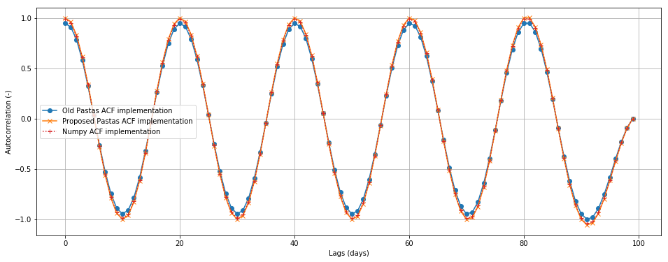

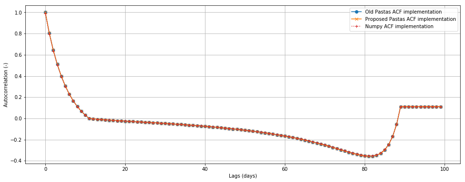

5. `Test new CCF (constant timesteps) <#top>`__\ 
-------------------------------------------------

The original implementation of ``pastas.stats.ccf`` is incorrect as it
combines the correlation of both the negative and positive lags at the
same time. In the example of the sine waves it can be seen that the
original pastas.stats.ccf function results in a correlation of 1.0 at
lag=0. This is obviously incorrect as the sines were shifted relative to
one another.

For constant timesteps it is possible to compare the result with
``numpy.correlate``. As can be seen, the new implementation of ``ccf``
yields the exact same result as numpy.

.. code:: ipython3

    for (s, ss) in [(s1, s2), (s5, s6)]:
        ccfdf = compare_ccf_funcs(s, ss, lags=np.arange(0, 100))
        ccfdf.head()

.. parsed-literal::

    C:\Users\dbrak\Anaconda3\lib\site-packages\ipykernel_launcher.py:155: RuntimeWarning: invalid value encountered in less_equal
    

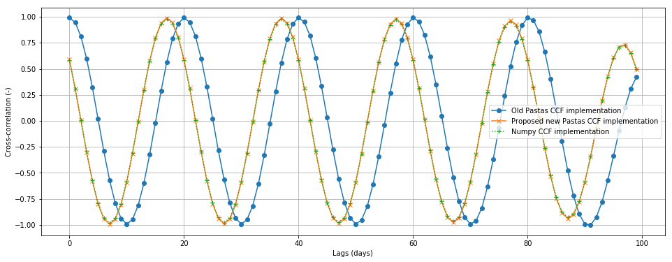

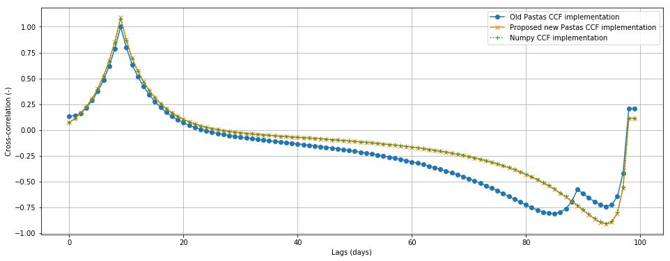

6. `Test new ACF (uneven timesteps) <#top>`__\ 
-----------------------------------------------

.. code:: ipython3

    for s in [s4, s8]:
        compare_acf_funcs(s, lags=np.arange(50), numpycorr=False, bin_method="rectangle")

.. parsed-literal::

    C:\Users\dbrak\Anaconda3\lib\site-packages\ipykernel_launcher.py:155: RuntimeWarning: invalid value encountered in less_equal
    

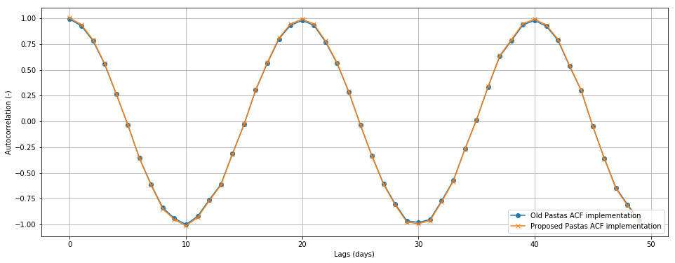

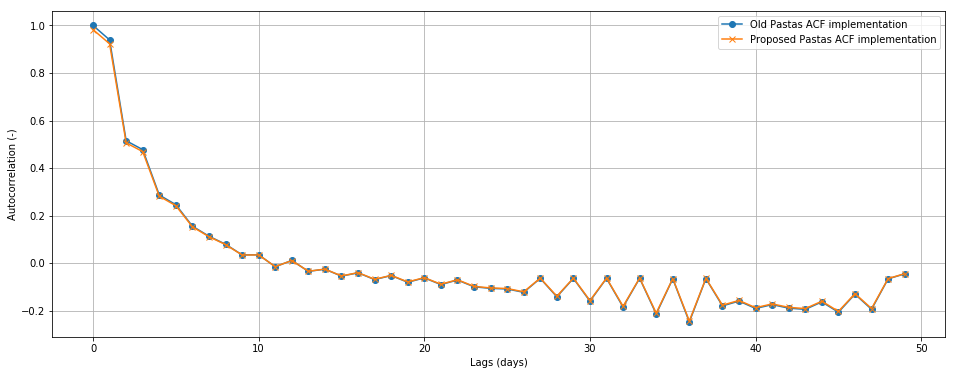

7. `Test new CCF (different timesteps) <#top>`__\ 
--------------------------------------------------

The old Pastas method gets the lags at which maximum correlations occur
wrong. The new method performs better in this regard. In the case of the
shifted peaks, the new method correctly identifies the lag at which the
maximum correlation occurs but the value of the correlation is larger
than 1.0. The old pastas method scaled the result by the absolute
maximum of the calculated correlation series. Perhaps this should be an
option?

.. code:: ipython3

    for (s, ss) in [(s3, s4), (s7, s8)]:
        ccfdf = compare_ccf_funcs(s, ss, lags=np.arange(0, 100), numpycorr=False, bin_method="rectangle", scale_w_max=False)

.. parsed-literal::

    C:\Users\dbrak\Anaconda3\lib\site-packages\ipykernel_launcher.py:155: RuntimeWarning: invalid value encountered in less_equal
    

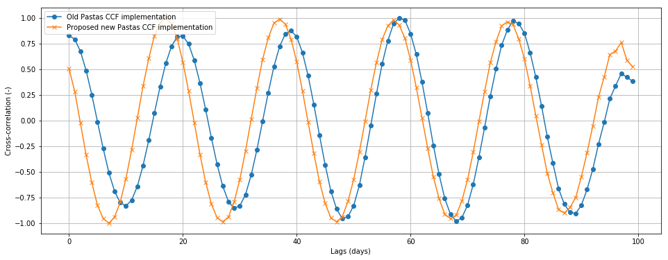

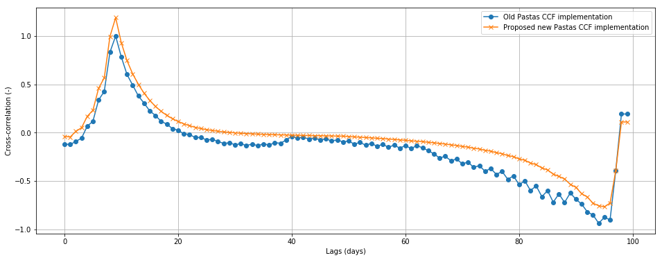

