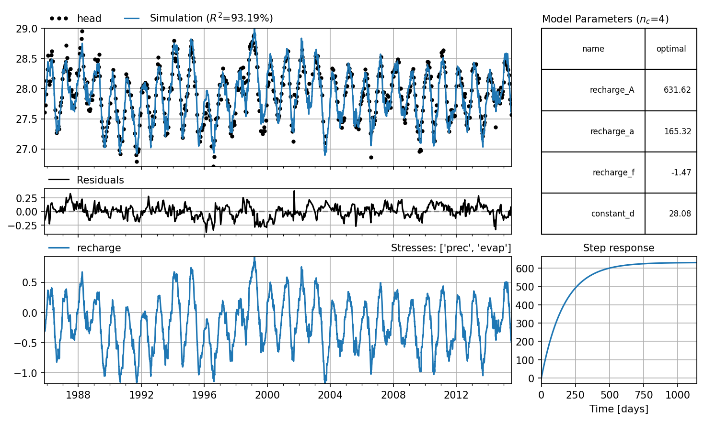

Introduction
============
Pastas is an open source python package for processing, simulating and
analyzing hydrological time series. The object oriented structure allows for
the quick implementation of new model components. Time series models can be
created, calibrated, and analysed with just a few lines of python code with
the built-in optimization, visualisation, and statistical analysis tools.

.. toctree::
    :maxdepth: 2
    :hidden:

    About <about/index>
    Getting Started <getting_started>
    User Guide <concepts/index>
    Examples <examples/index>
    Development <developers/index>
    API Docs <api/index>
    Release Notes <release_notes>
